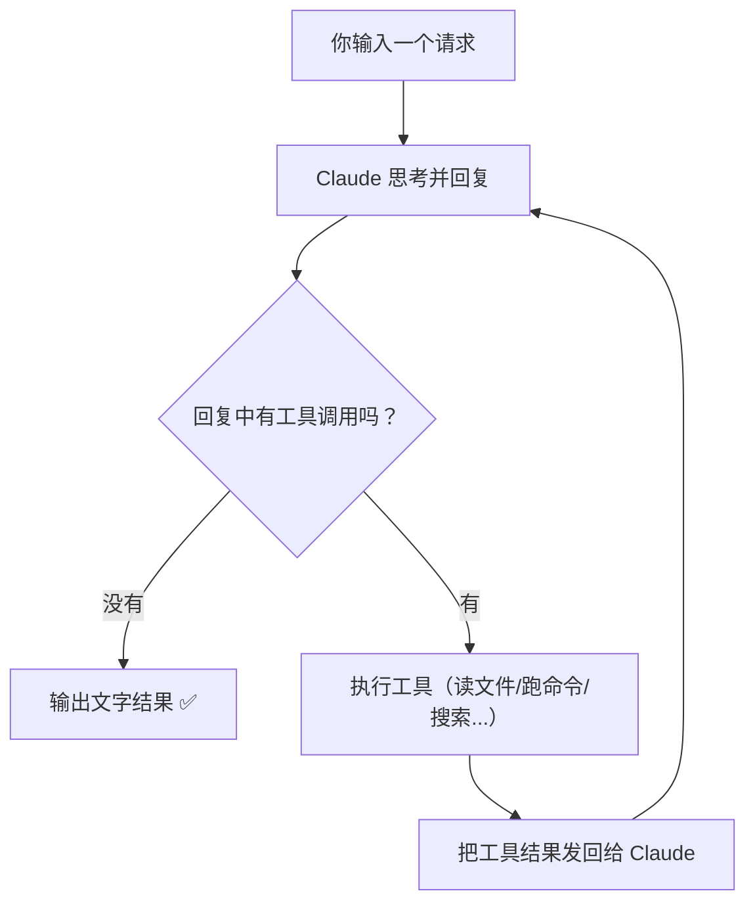

# Core idea: one loop rules them all

## Reset your mental model

If you picture the architecture like this:

```
User input → intent classifier → RAG retrieval → task planner → DAG orchestrator → executor → output
```

—that is **not** how Claude Code is structured. In practice it looks more like:

```
User input → model → done? → no → run tools → feed results back → done? → …
```

**That is it.** A `while` loop.

## The whole system in one diagram



This is how Claude Code operates end to end. Anthropic calls it the **agentic loop**.

## Pseudocode version

If you turn the diagram into code, you get something like:

```python
while True:
    response = call_claude(messages)

    if response.has_no_tool_calls():
        print(response.text)
        break

    for tool_call in response.tool_calls:
        result = execute(tool_call)
        messages.append(result)
```

Those few lines are the **spine** of Claude Code—amid tens of thousands of lines of TypeScript. Everything else is **around** that loop: more tools, permission checks, UI, context management, error handling, and so on.

## What is *not* in the box?

::: info Things you might expect—but are not there
| You might expect | Reality |
|------------------|---------|
| Intent classifier | ❌ None. The model decides what you want. |
| RAG / vector search | ❌ None. File search uses ripgrep-style tooling. |
| DAG task orchestration | ❌ None. The model chooses order of operations. |
| Separate planner + executor | ❌ None. One model does both. |
| Multi-model routing | ❌ None. One Claude model throughout. |
:::

## Why keep it this “simple”?

Anthropic’s design stance is **“Less scaffolding, more model.”**

In other words:

> Instead of writing a lot of code to “help” the model decide, trust a capable model to decide for itself.

| Typical AI-app pattern | Claude Code’s pattern |
|------------------------|------------------------|
| Classify intent, then route to handlers | No classifier—hand the request and tool list to the model |
| RAG to inject code snippets | No retrieval layer—let the model grep/glob on demand |
| DAGs to fix execution order | No DAG—the model sequences its own steps |
| Small model for easy tasks, large for hard ones | One model; rely on its quality |

::: tip Intuition check
Picture a very sharp intern.

**The heavy-handbook approach:** a 200-page SOP—if the user says X, do Y, with flowcharts for every case.

**The Claude Code approach:** a toolbox (terminal, filesystem, search) and “figure out how to finish this; tell me when you’re done.”

When the “intern” is already strong, the giant manual mostly **gets in the way** of flexibility.
:::

## What this means for you

If you want to build your own coding agent, the main takeaways are:

1. **Avoid over-engineering.** A tight loop, solid tools, and good prompts go a long way.
2. **Lean on the model’s reasoning.** Do not replace its judgment with brittle code paths.
3. **Invest in tools and permissions.** That is where the real engineering pays off.

Next: how Claude Code actually boots—[startup flow: the CLI skeleton](/en/3-how-it-starts).
