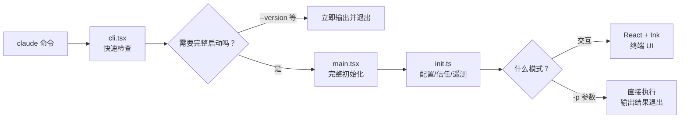
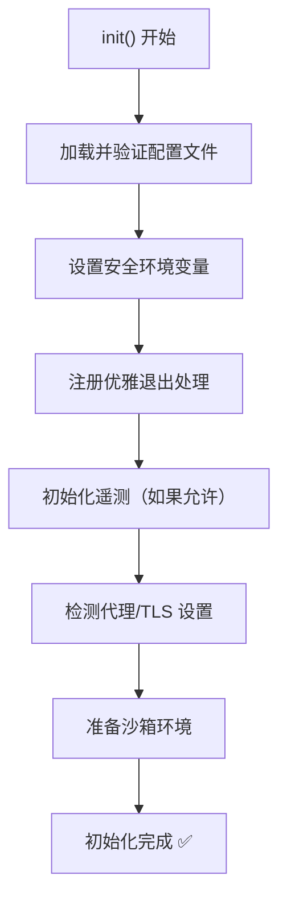

# Startup flow: the CLI skeleton

## The moment you hit Enter on `claude`

You type `claude` in the terminal and press Return. What happens between that keystroke and the interactive UI?



## Two entry points—why?

Claude Code has two entry files: `cli.tsx` and `main.tsx`.

**`cli.tsx`** runs first. Its job is narrow:

- Handle “fast exit” commands such as `claude --version`
- If full startup is needed, **dynamically import** the heavy modules

**`main.tsx`** is the real application entry. It:

- Registers CLI commands and flags with Commander.js
- Runs initialization (config, safety checks, telemetry)
- Chooses interactive mode vs one-shot execution from the arguments

::: tip Why split the entry?
The shipped bundle is a **~13 MB JavaScript file**. Loading all of that for `claude --version` would make simple commands feel sluggish. The split keeps trivial invocations **instant** and defers the big import until you need the full app.

This is a common CLI pattern: **lazy loading**.
:::

## Initialization: before the model sees you

`init.ts` is where setup happens. Before your first message reaches the model, the runtime has to get its house in order:



Highlights:

- **Config layering:** values merge from several sources; later layers override earlier ones:
  ```
  默认值 → 全局配置 → 项目配置 → 本地配置 → CLI 参数 → 环境变量
  ```
- **Trust prompts:** the first time you open a project directory, Claude Code may ask you to confirm you trust it
- **Graceful exit:** handlers for SIGINT/SIGTERM so interrupts are less likely to leave half-written files

## Two run modes

After init, behavior branches based on how you invoked the tool.

### Interactive mode (default)

The usual experience: a React + Ink terminal UI and an ongoing conversation:

```
You: Refactor this function for me.
Claude: Let me read it first… (Read)
        Here’s what’s wrong… (analysis)
        Applying edits… (Edit)
        Done—want a quick summary?
You: Add a test too.
Claude: …
```

### One-shot mode (`-p`)

For scripts and automation: run once, print to stdout, exit:

```bash
claude -p "Our README is missing install steps—add them."
```

No full TUI; good for CI/CD, wrappers, and shell pipelines.

## Commander.js layout

Claude Code uses [Commander.js](https://github.com/tj/commander.js) for the CLI. If you have built Node CLIs before, this will feel familiar:

```
claude                    → interactive (default)
claude -p "..."           → one-shot
claude mcp serve          → MCP server
claude config set ...     → configuration
claude doctor             → diagnostics
claude resume             → resume last session
```

Each subcommand maps to a file under `commands/`, wired up from `commands.ts`.

## Recap

Startup is a standard CLI story:

1. **Thin entry** → cheap commands stay cheap  
2. **Full init** → config, safety, environment  
3. **Mode switch** → interactive vs one-shot  

No magic—just solid engineering. Next we get to the real engine—[how the agent loop works](/en/4-agent-loop).
