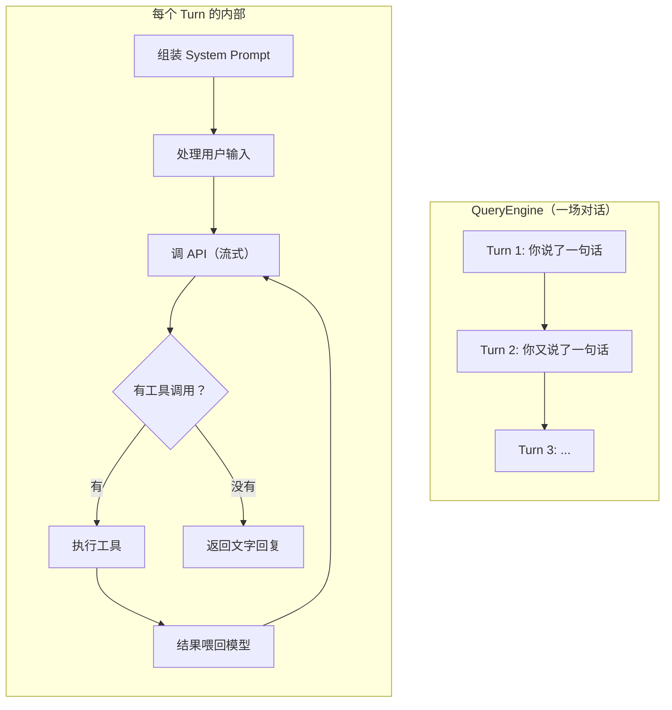
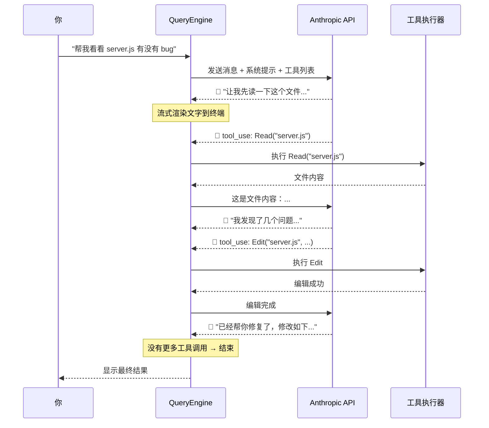

# Agent loop: the heart

## QueryEngine—the center of gravity

If Claude Code were a person, **`QueryEngine`** would be the heart. That class owns an entire conversation: what you said, what the model returned, which tools ran, and how many tokens you have burned.

Every line you type in the terminal is one **turn** for the QueryEngine.



## System prompt: who the model is here

Before each API call, QueryEngine builds a **system prompt**—background that tells the model where it is, what it can do, and what rules apply.

Typical contents:

| Piece | Role |
|-------|------|
| Tool catalog | Read, Bash, Edit, and the rest |
| Working directory | Which project tree it is in |
| Project context | Git state, layout, etc. |
| `CLAUDE.md` | Project-specific instructions when present |
| Permission rules | What needs confirmation vs auto-approve |
| MCP servers | Extra tools from connected servers |

::: tip About CLAUDE.md
Think of `CLAUDE.md` as the project’s **orientation doc**—e.g. “Python 3.12, pytest for tests, PostgreSQL in dev.” Claude Code reads it on relevant turns so the model **starts aligned** with your stack and conventions.
:::

## Streaming: why it feels snappy

The client uses a **Server-Sent Events (SSE)** streaming API. Tokens arrive **as they are generated**, not after the full answer is finished.

That means:

- The UI can show text as it streams in  
- Tool calls can be detected **before** the response ends  
- The experience feels faster than waiting for one big payload  



## Token budget: the loop is not infinite

Context is capped around **200K tokens**. QueryEngine has to budget:

```
200K tokens
├── System Prompt    ～ 5-15K（取决于工具数量和项目信息）
├── 对话历史         ～ 大部分空间在这
├── 当前工具结果     ～ 可变
└── 预留生成空间     ～ 模型需要空间写回复
```

When usage climbs into roughly **75–92%**, **compaction** may run to shrink history. See [Chapter 7](/en/7-context) for detail.

## Other stop conditions

Besides the token ceiling:

- **maxTurns** — cap loop iterations against runaway tool cycles  
- **maxBudgetUsd** — spending guardrail for API cost  
- **User interrupt** — Ctrl+C anytime  
- **Model stops with text only** — no further tool calls, turn ends  

## AsyncGenerator: streaming without spaghetti

`submitMessage` on QueryEngine is an **AsyncGenerator**. Quick mental model:

::: info What is an AsyncGenerator?
**Normal function:** call once, one return value.  
**Generator:** call once, yield many values on demand.  
**AsyncGenerator:** same idea, but each step can **await** I/O (e.g. network).

Claude Code uses it because:

- The API is streamed (chunks arrive over time)  
- The UI should update incrementally  
- Tool runs **interrupt** the stream (see tool call → execute → resume)

Consumers can write: `for await (const msg of engine.submitMessage(input))` and handle every partial update in order.
:::

## One full interaction, end to end

Putting it together:

1. You type: “Fix the failing tests under `tests/`.”
2. QueryEngine assembles the system prompt (tools + project + rules).
3. Your input is processed (slash commands, model switches, etc.).
4. Anthropic API is called; the response streams back.
5. The model chooses Read on test files; results return.
6. It diagnoses failures, passes permission checks, runs Edit.
7. It runs Bash (`npm test`) to verify.
8. Tests pass; the model answers with plain text.
9. Session state is persisted; the turn completes.

All of that still lives inside the same **while**-style agent loop.

Next: what those “tools” actually are—[tool system: giving the AI hands](/en/5-tool-system).
