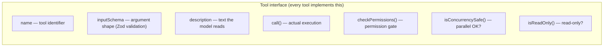
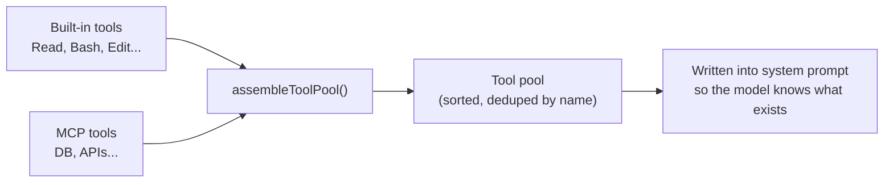
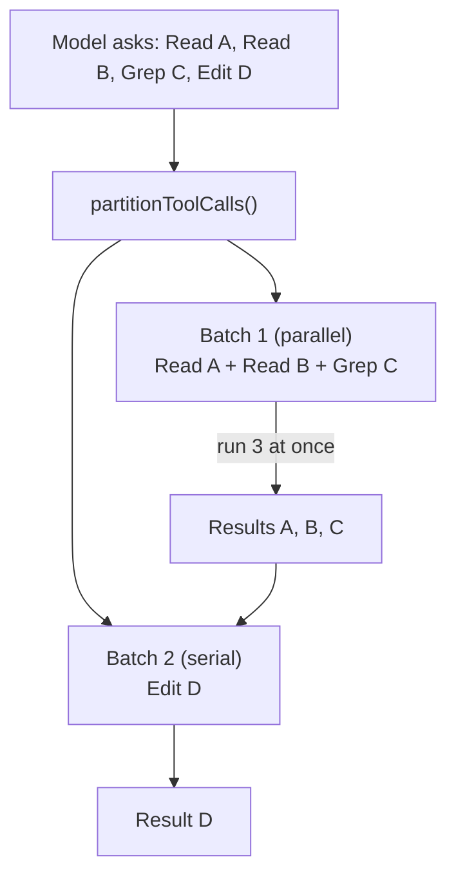

# The tool system: giving the AI hands

## No tools = talk only

A language model, by itself, only produces text. It cannot read your files, run commands, or search the web. **Tools** are the bridge between the model and the real world.

Claude Code defines a standard tool interface so the model can:

- Read your code → **Read**
- Search file contents → **Grep**
- Change code → **Edit**
- Run commands → **Bash**
- …and more

## Eight core tools

Claude Code ships with roughly 30 built-in tools, but eight matter most:

| Tool | What it does | Analogy |
|------|----------------|---------|
| **Bash** | Run arbitrary shell commands | Swiss Army knife |
| **Read** | Read file contents | Open a file and look |
| **Write** | Create or overwrite a file | Write a file from scratch |
| **Edit** | Replace a specific span in a file | Find a passage, swap it for another |
| **Grep** | Regex search over file contents | Project-wide text search |
| **Glob** | Find files by name pattern | “Give me every `.ts` file” |
| **Task** | Start a sub-agent | Send a clone to handle a subtask |
| **TodoWrite** | Structured task tracking | A living todo list |

::: tip Bash is the universal escape hatch
In theory, Bash alone can do almost anything—read files (`cat`), write files (`echo >`), search (`grep`), and so on. Dedicated tools are safer, easier to control, and return cleaner output for the model.

Treat Bash as a last resort when nothing else fits. That is why Bash gets the strictest permission checks.
:::

## What does a tool look like?

Every tool follows the same interface—a “contract” that says what each tool must provide:

Benefits of one shared interface:

- **Adding tools is straightforward**: fill in the contract.
- **MCP and built-in tools look the same** to the model.
- **Permission checks are mandatory**: each tool declares what it needs.

## How does the model use tools?

Three steps:

### Step 1: Registration

At startup, built-in tools are collected into a list, merged with MCP tools, then sorted and deduplicated by name (built-ins win on conflicts).

### Step 2: Invocation

The model says something like “I want Read on `server.js`.” Inputs are validated with Zod, permissions are checked, then the tool runs.

### Step 3: Response

When a tool finishes, its output comes back as a `tool_result` message. The model reads it and decides what to do next.

## Read-only vs write: the concurrency trick

This is one of Claude Code’s cleverest design choices.

The model may request several tool calls in one turn—e.g. read A, read B, grep C, then edit D.

Claude Code does not run them naïvely one by one. `partitionToolCalls` **partitions** them intelligently:

**Rules:**

- Consecutive **read-only** tools (Read, Grep, Glob) → **run in parallel** (up to 10 at a time).
- **Write** tools (Bash, Edit, Write) → **run serially**.

::: info Why split it this way?
Reads do not mutate state, so many reads can safely overlap. Writes can conflict (two edits to the same file), so they run one after another.

That optimization makes “skim several files, then decide” scenarios much faster.
:::

## Safe defaults

`buildTool()` uses **conservative defaults**:

- Not parallel-safe by default (`isConcurrencySafe = false`).
- Not read-only by default (`isReadOnly = false`).

That is **fail-closed**: if a developer forgets to mark a tool as parallel-safe, it will not be parallelized by accident. Safety first.

## MCP: unlimited extension

MCP (Model Context Protocol) lets you add custom tools—for example:

- Query a database.
- Call an internal company API.
- Drive a browser (Playwright).

MCP tools are merged with built-ins in `assembleToolPool`. To the model, they are indistinguishable—just more things it can call.

## Takeaways

Core principles of the tool system:

1. **One interface** for every tool.
2. **Safe defaults**: not parallel, not read-only, unless explicitly declared.
3. **Smart concurrency**: parallelize reads, serialize writes.
4. **Equal treatment**: MCP and built-in tools look the same to the model.

Giving an AI tools is risky—it might `rm -rf` your project. How do we stop that? Next: [Security model: five layers of defense](/en/6-security).
