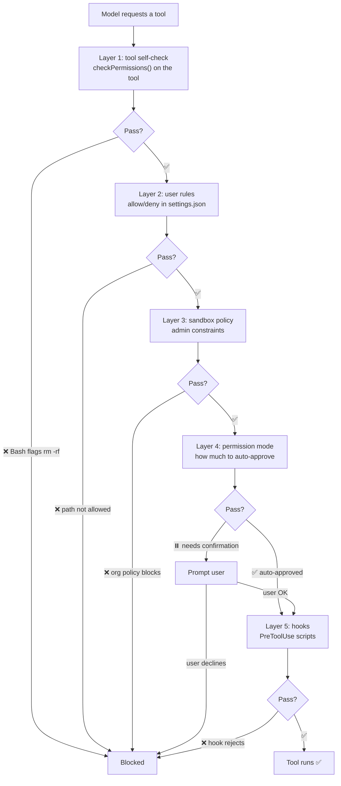

# Security model: five layers of defense

## Why security matters

Imagine an AI that can edit your code, run shell commands, read any file, and sometimes reach the network. Without guardrails it could:

- Wipe your project by mistake (`rm -rf .`).
- Push secrets to a public repo.
- Write bad values into production config.
- Run harmful commands.

Claude Code aims to be **capable** and **contained**. Its answer is a five-stage permission pipeline.

## Five layers

Every tool call is checked **before** it runs. **If any layer says no, the call does not execute.**



### Layer 1: tool self-check

Each tool implements `checkPermissions()`. Bash, for example, pattern-matches risky commands:

- `rm -rf /` → deny
- `git push --force` → warn
- `curl | bash` → high-risk flag

Read checks paths stay inside the project. Edit checks the target file exists.

### Layer 2: user rules

You can define allow and deny lists in `settings.json`:

```json
{
  "allow": ["Read(**)", "Bash(npm:*)"],
  "deny": ["Bash(rm:*)", "Write(~/.ssh/*)"]
}
```

Roughly: “Allow reads everywhere and npm-related Bash; forbid destructive `rm` and writes under `~/.ssh`.”

### Layer 3: sandbox policy

In enterprise setups, admins can set global limits on paths, commands, and network access. Most individuals never touch this layer.

### Layer 4: permission modes

Claude Code exposes modes that control **what still asks you**:

| Mode | File edits | Shell | Good for |
|------|------------|-------|----------|
| **default** | ask each time | ask each time | First-time use, maximum caution |
| **acceptEdits** | auto-approve | ask each time | Everyday development |
| **plan** | disabled | disabled | Read-only exploration |
| **bypass** | auto-approve | auto-approve | When you fully trust the run |
| **auto** | auto-approve | auto-approve | CI/CD automation |

### Layer 5: hook interception

The most flexible layer: custom scripts before and after tools run.

**PreToolUse** — before execution, your script can:

- Block the call outright.
- Rewrite tool inputs.
- Allow without changes.

**PostToolUse** — after execution, you can:

- Validate outputs.
- Run a linter after every edit.
- Log actions for audit.

::: tip Practical hook idea
Run a PreToolUse hook on Bash that scans for sensitive tokens or password-like strings in the command string and rejects the call automatically.

That scales better than eyeballing every command yourself.
:::

## Why five layers instead of one?

Each layer solves a different problem:

| Layer | Problem it addresses |
|-------|----------------------|
| Tool self-check | Obvious hazards at the implementation level |
| User rules | Personal policy—“what is OK in *my* repo” |
| Sandbox policy | Organizational compliance |
| Permission modes | Tune automation vs prompts for the situation |
| Hooks | Programmable last-mile policy |

**Most calls clear the first two layers quickly.** You only see prompts for genuinely unusual actions. Good security feels invisible until something actually matters.

## Takeaways

What matters about Claude Code’s security model:

1. **Defense in depth** — bypassing one layer still leaves others.
2. **Default to caution** — anything not clearly allowed tends to require confirmation.
3. **Programmable** — hooks encode whatever policy you need.
4. **Modes for every posture** — from strictest to fully automated.

Security is handled; context is another bottleneck—models forget over long threads. Next: [Smart memory: context management](/en/7-context).
