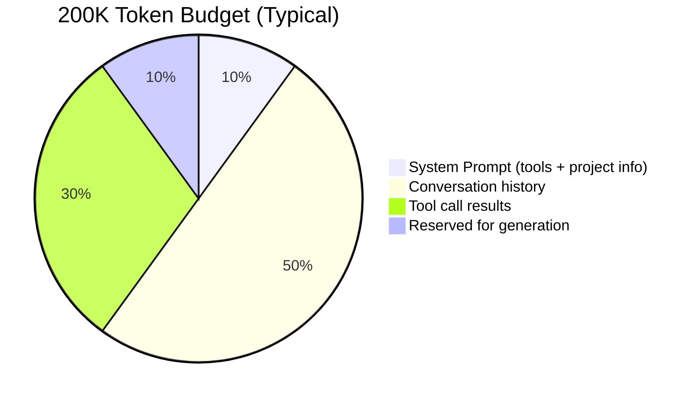
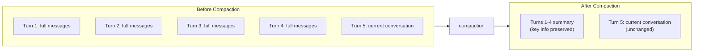
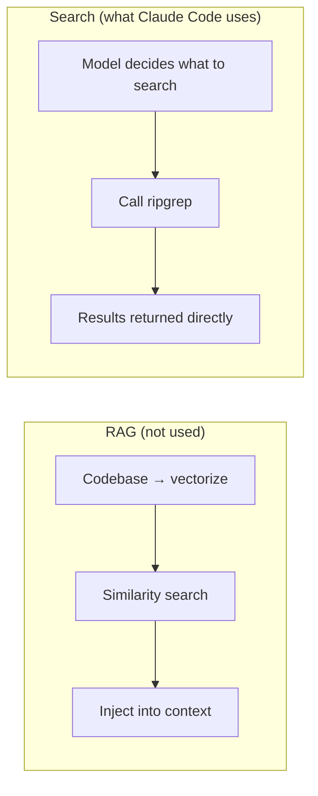
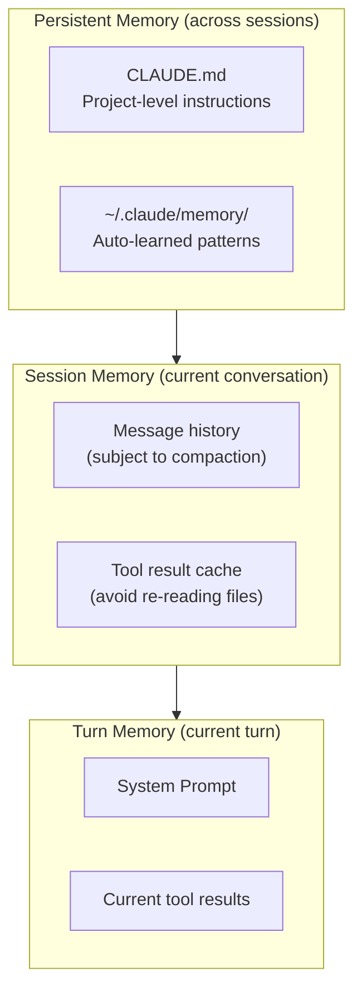

# Smart Memory: Context Management

## How to Spend a 200K Budget

Claude's context window is **200K tokens** (roughly 150,000 English words). Sounds massive, but in an Agent scenario it gets consumed faster than you'd expect:

A single `Read` call might return thousands of tokens of file content. A `Bash` call might dump massive log output. After a dozen turns, the history alone eats most of the budget.

**What happens when you run out?** That's where Claude Code's compression strategy kicks in.

## Auto-Compaction: Summarize, Don't Discard

When context usage hits **75-92%**, Claude Code automatically triggers **compaction**:

**Compaction isn't deletion.** It summarizes earlier turns into concise recaps, keeping essential information (e.g., "user asked me to fix a bug in X, I edited and tests pass") while dropping verbose details (full file contents, raw command output).

::: info Customizable compaction
Claude Code has pre/post hooks for the compaction step. You can mark certain messages as "never compress" or inject additional context after compression.

This is useful for critical project constraints — like "never modify production.config.js" — that must survive every compaction cycle.
:::

## "Search, Don't Index"

This is Claude Code's most controversial — and most educational — design decision.

### What you'd expect

Many AI coding tools use **RAG (Retrieval-Augmented Generation)**:

1. On startup, embed the entire codebase into vectors
2. When the user asks a question, find the most relevant code snippets
3. Inject those snippets into the model's context
4. Model answers based on the retrieved context

### What Claude Code actually does

No RAG. It lets the model call **Grep** (ripgrep) and **Glob** tools to search directly.

### Why grep beats RAG here

| Dimension | RAG | grep search |
|-----------|-----|-------------|
| **Needs indexing** | Yes. Slow startup, must stay in sync | No. Search on demand |
| **External dependencies** | Needs embedding service | Just ripgrep (local) |
| **Security** | Code may be sent to external embedding API | Fully local, no code leakage |
| **Accuracy** | Semantic approximation, may miss things | Exact match, never misses |
| **Complexity** | Must maintain index, handle incremental updates | Zero maintenance |
| **Token cost** | Lower (only inject relevant snippets) | Higher (model may search multiple times) |

::: tip The core trade-off
RAG saves tokens but adds complexity. Grep costs more tokens but is dead simple.

When the model is smart enough to know *what* to search for, and the context window is large enough (200K), the "brute force" approach of grep + model judgment outperforms a carefully designed retrieval pipeline.

Anthropic's team has said: they **tried RAG** and their internal benchmarks showed the grep approach performed better.
:::

## The Memory Hierarchy

Claude Code's "memory" isn't just conversation history. It has a layered system:

| Layer | Lifetime | Contents |
|-------|----------|----------|
| **CLAUDE.md** | Permanent (you maintain it) | Project rules, preferences, architecture info |
| **Auto-memory** | Across sessions | Patterns Claude learns about your project |
| **Message history** | Current session | Your conversation with Claude |
| **Tool cache** | Current session | File contents already read (avoids duplicate reads) |
| **System Prompt** | Each API call | Tool list, project info, rules |

## What This Looks Like in Practice

1. **Short conversations** (a few turns): No compaction needed, 200K is plenty
2. **Medium conversations** (a dozen turns): One compaction, barely noticeable
3. **Long conversations** (dozens of turns): Multiple compactions, key info preserved but early details may fade
4. **Across sessions**: CLAUDE.md and auto-memory ensure project knowledge is never lost

## Key Takeaways

1. **Summarize, don't discard** — old messages become concise recaps, not empty holes
2. **Simple beats clever** — grep search is more reliable than RAG in this context
3. **Layered memory** — different lifetimes need different storage strategies
4. **Security first** — never send code to external services for indexing

You now understand all of Claude Code's core systems. Final chapter — [Build Your Own: From Reader to Builder](/en/8-build-your-own).
