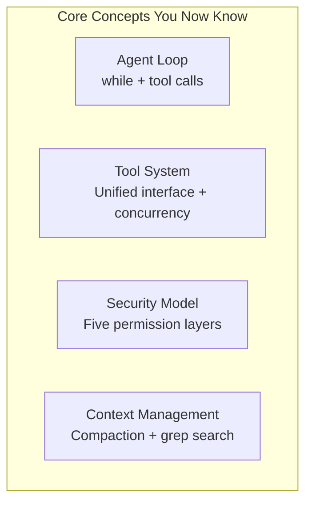
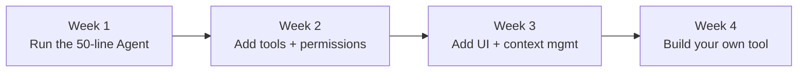

# Build Your Own: From Reader to Builder

## What You've Learned

Over the last 7 chapters, you've seen the full picture of Claude Code:



These aren't Claude Code-specific ideas — they're the **building blocks of any AI Agent system**.

## 50 Lines of Code: A Minimal Agent

Here's a working minimal AI Agent. It implements the core loop from Claude Code — call the model, run tools, loop until done:

```python
import anthropic, subprocess, json

client = anthropic.Anthropic()

tools = [
    {
        "name": "bash",
        "description": "Run a bash command and return stdout",
        "input_schema": {
            "type": "object",
            "properties": {"command": {"type": "string"}},
            "required": ["command"]
        }
    },
    {
        "name": "read_file",
        "description": "Read a file and return its contents",
        "input_schema": {
            "type": "object",
            "properties": {"path": {"type": "string"}},
            "required": ["path"]
        }
    }
]

def run_tool(name, args):
    if name == "bash":
        r = subprocess.run(args["command"], shell=True,
                          capture_output=True, text=True, timeout=30)
        return r.stdout + r.stderr
    if name == "read_file":
        return open(args["path"]).read()
    return "Unknown tool"

def agent(task):
    messages = [{"role": "user", "content": task}]

    while True:
        resp = client.messages.create(
            model="claude-sonnet-4-20250514",
            max_tokens=4096,
            tools=tools,
            messages=messages,
        )
        # Collect assistant response
        messages.append({"role": "assistant", "content": resp.content})

        # No more tool calls -> done
        if resp.stop_reason == "end_turn":
            return [b.text for b in resp.content if hasattr(b, "text")]

        # Execute tool calls and feed results back
        results = []
        for block in resp.content:
            if block.type == "tool_use":
                output = run_tool(block.name, block.input)
                results.append({
                    "type": "tool_result",
                    "tool_use_id": block.id,
                    "content": output
                })
        messages.append({"role": "user", "content": results})

# Try it
for line in agent("List the files in the current directory"):
    print(line)
```

::: tip This IS Claude Code's core
Look at that `while True` loop — it's the skeleton of Claude Code's 40,000+ lines of code. The difference is just more tools, permission checks, UI, and context management.

You can write the Agent core in less time than it takes to finish a cup of coffee.
:::

## Which Model Should You Use?

You don't have to use Claude. Any model that supports **tool use / function calling** works:

| Approach | Models | Cost | Quality |
|----------|--------|------|---------|
| **Anthropic API** | Claude Sonnet / Opus | Per-token pricing | Best for tool use |
| **OpenAI API** | GPT-4o / o3 | Per-token pricing | Very good |
| **Local models** | Qwen, DeepSeek, Llama | Free (needs GPU) | Usable, weaker tool calling |
| **API aggregators** | Various platforms | Budget pricing | Depends on underlying model |

**You don't need to run models locally.** Most people call cloud APIs. Local models still lag behind in tool use accuracy.

## How Is This Different from Existing Tools?

| | Claude Code | Cursor | Cline | Build Your Own |
|---|---|---|---|---|
| **Who drives** | AI drives, you supervise | You drive, AI assists | Flexible | You decide |
| **Models** | Claude only | Multi-model | Any model | Any model |
| **Interface** | Terminal | IDE | IDE extension | You design it |
| **Customization** | Moderate | Limited | Moderate | Total freedom |
| **Data privacy** | Cloud | Cloud | You control | You control |
| **Cost** | From $20/mo | From $20/mo | API costs only | API costs only |

**Building your own isn't about making "a better Cursor."** It's about:

1. **Learning** — Understanding Agent architecture is the hottest skill in tech right now
2. **Specialization** — Build tools focused on your domain (data analysis, DevOps, docs, etc.)
3. **Control** — Own your data flow and costs completely
4. **Product** — Turn it into a product serving a specific audience

## Three Levels of Project Ideas

### Beginner: Personal CLI Assistant

Expand the 50-line code above:
- Add file editing tools (Write, Edit)
- Add basic permission confirmation before bash commands
- Add conversation history save/restore
- Use [Rich](https://github.com/Textualize/rich) (Python) or [Ink](https://github.com/vadimdemedes/ink) (Node.js) for a polished terminal UI

### Intermediate: Domain-Specific Agent

Pick a domain you know well and build a specialized tool:
- **Data Analysis Agent**: tools for CSV reading, SQL execution, chart generation
- **DevOps Agent**: tools for service health checks, log reading, service restarts
- **Documentation Agent**: tools for Markdown parsing, TOC generation, link checking
- **Code Review Agent**: tools for reading PR diffs, checking conventions, generating reviews

The key is **tool design** — what tools you give the Agent defines what it can do.

### Advanced: Agent Platform

Bigger ideas:
- **MCP Tool Marketplace** — A discovery and distribution platform for MCP servers
- **Agent Debugger** — Visualize an Agent's execution trace for debugging
- **Multi-Agent Framework** — Inspired by Claude Code's Task tool and Teams system

## Suggested Learning Path



| Phase | Goal | Resources |
|-------|------|-----------|
| Week 1 | Get the minimal Agent running | The 50-line code in this chapter |
| Week 2 | Add 3-5 tools + basic permissions | Reference: `tools/` directory in source |
| Week 3 | Add streaming output + context compaction | Reference: `services/compacting/` in source |
| Week 4 | Build a domain-specific Agent MVP | Your own idea |

## Further Resources

### Official
- [Anthropic Engineering Blog: Best Practices](https://www.anthropic.com/engineering/claude-code-best-practices)
- [Claude Code Documentation](https://code.claude.com/docs)

### Community Analysis
- [Inside Claude Code's Architecture](https://dev.to/oldeucryptoboi/inside-claude-codes-architecture-the-agentic-loop-that-codes-for-you-cmk) — Deep English architecture analysis
- [Architecture & Internals Guide](https://cc.bruniaux.com/guide/architecture/) — Most comprehensive architecture doc
- [Claude Code Reverse Engineering](https://yuyz0112.github.io/claude-code-reverse/README.zh_CN.html) — Runtime behavior analysis
- [Claude Code Source Analysis](https://claudecoding.dev/) — Chapter-by-chapter series

### Hands-On Tutorials
- [Build Your Own in Python (250 Lines)](https://www.heyuan110.com/posts/ai/2026-02-24-build-magic-code/)
- [Claude Agent SDK TUI](https://www.mager.co/blog/2026-03-14-claude-agent-sdk-tui/)
- [OpenCode](https://opencode.ubitools.com/) — Open-source terminal AI Agent

---

::: info One Last Thing
Claude Code's architecture teaches us a counterintuitive lesson: **when the AI model is powerful enough, the best framework is no framework.** A while loop + good tools + good prompts is all you need for a production-grade AI Agent.

Now it's your turn.
:::
