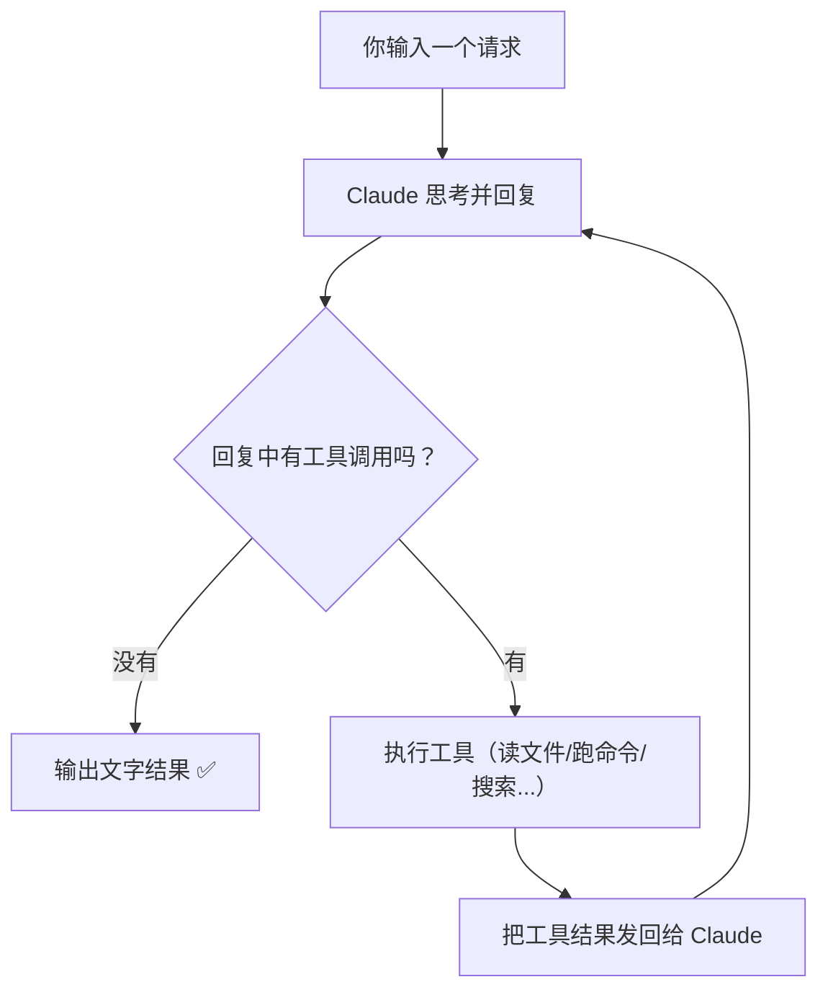

# 核心理念：一个循环统治一切

## 先破除你的想象

如果你以为 Claude Code 的架构是这样的：

```
用户输入 → 意图分类器 → RAG 向量检索 → 任务规划器 → DAG 编排器 → 执行器 → 输出
```

那你猜错了。实际上，Claude Code 的核心架构是：

```
用户输入 → 模型 → 做完了吗？→ 没有 → 执行工具 → 把结果喂回模型 → 做完了吗？→ ...
```

**就这么简单。** 一个 while 循环。

## 用一张图看懂全局



这就是整个 Claude Code 的运作方式。Anthropic 把这个叫做 **Agentic Loop**（Agent 循环）。

## 用伪代码表示

如果把上面的图翻译成代码，大概就是：

```python
while True:
    response = call_claude(messages)

    if response.has_no_tool_calls():
        print(response.text)
        break

    for tool_call in response.tool_calls:
        result = execute(tool_call)
        messages.append(result)
```

这不到 10 行的代码，就是 Claude Code **4 万多行源码的核心骨架**。其余的代码都是围绕这个循环的"增强"：更多工具、权限检查、UI 渲染、上下文管理、错误处理等等。

## 这里面没有什么？

::: info 你可能以为会有但实际上没有的东西
| 你以为有的 | 实际上 |
|------------|--------|
| 意图分类器 | ❌ 没有。模型自己判断你想干什么 |
| RAG / 向量检索 | ❌ 没有。直接用 ripgrep 搜文件 |
| DAG 任务编排 | ❌ 没有。模型自己决定执行顺序 |
| 规划器 + 执行器 | ❌ 没有。模型同时担任两个角色 |
| 多模型路由 | ❌ 没有。始终用同一个 Claude 模型 |
:::

## 为什么要这么"简单"？

Anthropic 的设计哲学是：**"Less scaffolding, more model"**（少搭框架，多信模型）。

这句话的意思是：

> 与其写一堆复杂的代码来"帮助"模型做决定，不如让模型足够聪明，自己做所有决定。

具体来说：

| 传统 AI 应用的做法 | Claude Code 的做法 |
|-------------------|-------------------|
| 先分类用户意图，再路由到不同处理器 | 不分类。直接把请求和工具列表给模型，让它自己选 |
| 用 RAG 检索相关代码片段注入上下文 | 不检索。让模型用 grep/glob 自己搜 |
| 用 DAG 定义任务执行顺序 | 不定义。模型自己决定先做什么后做什么 |
| 小模型做简单任务，大模型做复杂任务 | 只用一个模型。它够聪明 |

::: tip 小白理解指南
想象你雇了一个非常聪明的实习生。

**传统做法**是：给他一本 200 页的操作手册，每种情况都写好流程图，"如果客户说 X，你就做 Y"。

**Claude Code 的做法**是：给他一个工具箱（电脑终端、文件系统、搜索工具），然后说"这件事你自己想办法完成，做完告诉我"。

因为这个"实习生"（Claude 模型）已经足够聪明了，手册反而会限制他的灵活性。
:::

## 这对你意味着什么？

如果你想做一个自己的 AI Agent 工具，最重要的启示是：

1. **不要过度设计**。一个简单的循环 + 好的工具 + 好的提示词，就够了。
2. **信任模型的推理能力**。不要试图用代码代替模型的判断。
3. **把精力放在工具和权限上**。这才是真正需要用心做的部分。

下一章我们来看 Claude Code 具体是怎么启动的——[启动流程：CLI 的骨架](/zh/3-how-it-starts)。
