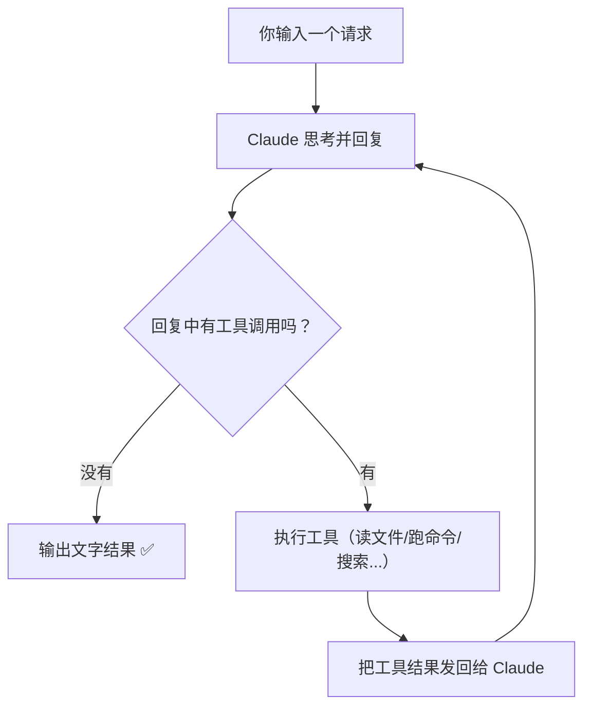

# 核心理念：一个循环统治一切

## 先讲一个故事

想象你雇了一个远程程序员，给他你电脑的远程访问权限。你会怎么做？

**如果你是 Cursor 的做法：** 你让他坐在你旁边，每次他要敲命令之前你看一眼，点个"允许"。简单粗暴，但你得一直盯着。

**如果你是 GitHub Copilot Agent 的做法：** 你给他一台全新的虚拟机，让他在里面随便折腾。搞完了把代码提交上来，你审核后再合并。安全，但他看不到你本地的环境。

**如果你是 Claude Code 的做法：** 你让他直接用你的电脑——但你给他配了一套极其精密的安检系统。他能做什么、不能做什么、哪些操作需要你点头、哪些可以自己来、甚至他想用 `rm -rf` 都要经过多层审查才能执行。

| 工具 | 安全哲学 | 优势 | 代价 |
|------|---------|------|------|
| Cursor | 人工盯梢 | 简单直接 | 你得一直在场 |
| Copilot Agent | 沙箱隔离 | 安全可控 | AI 看不到你的真实环境 |
| Claude Code | 精密安检 | AI 用你的真实环境干活 | 为此写了 51 万行代码 |

为什么 Anthropic 选了最难的那条路？因为只有这样，AI 才能用你的终端、你的环境、你的配置来干活——这才是"真正帮你写代码"，而不是"在一个干净房间里给你写一段代码然后复制过来"。

## 先破除你的想象

如果你以为 Claude Code 的架构是这样的：

```
用户输入 → 意图分类器 → RAG 向量检索 → 任务规划器 → DAG 编排器 → 执行器 → 输出
```

那你猜错了。实际上，Claude Code 的核心架构是：

```
用户输入 → 模型 → 做完了吗？→ 没有 → 执行工具 → 把结果喂回模型 → 做完了吗？→ ...
```

**就这么简单。** 一个 while 循环。

## 用一张图看懂全局



这就是整个 Claude Code 的运作方式。Anthropic 把这个叫做 **Agentic Loop**（Agent 循环）。

## 用伪代码表示

如果把上面的图翻译成代码，大概就是：

```python
while True:
    response = call_claude(messages)

    if response.has_no_tool_calls():
        print(response.text)
        break

    for tool_call in response.tool_calls:
        result = execute(tool_call)
        messages.append(result)
```

这不到 10 行的代码，就是 Claude Code **4 万多行源码的核心骨架**。其余的代码都是围绕这个循环的"增强"：更多工具、权限检查、UI 渲染、上下文管理、错误处理等等。

## 这里面没有什么？

::: info 你可能以为会有但实际上没有的东西
| 你以为有的 | 实际上 |
|------------|--------|
| 意图分类器 | ❌ 没有。模型自己判断你想干什么 |
| RAG / 向量检索 | ❌ 没有。直接用 ripgrep 搜文件 |
| DAG 任务编排 | ❌ 没有。模型自己决定执行顺序 |
| 规划器 + 执行器 | ❌ 没有。模型同时担任两个角色 |
| 多模型路由 | ❌ 没有。始终用同一个 Claude 模型 |
:::

## 为什么要这么"简单"？

Anthropic 的设计哲学是：**"Less scaffolding, more model"**（少搭框架，多信模型）。

这句话的意思是：

> 与其写一堆复杂的代码来"帮助"模型做决定，不如让模型足够聪明，自己做所有决定。

具体来说：

| 传统 AI 应用的做法 | Claude Code 的做法 |
|-------------------|-------------------|
| 先分类用户意图，再路由到不同处理器 | 不分类。直接把请求和工具列表给模型，让它自己选 |
| 用 RAG 检索相关代码片段注入上下文 | 不检索。让模型用 grep/glob 自己搜 |
| 用 DAG 定义任务执行顺序 | 不定义。模型自己决定先做什么后做什么 |
| 小模型做简单任务，大模型做复杂任务 | 只用一个模型。它够聪明 |

::: tip 小白理解指南
想象你雇了一个非常聪明的实习生。

**传统做法**是：给他一本 200 页的操作手册，每种情况都写好流程图，"如果客户说 X，你就做 Y"。

**Claude Code 的做法**是：给他一个工具箱（电脑终端、文件系统、搜索工具），然后说"这件事你自己想办法完成，做完告诉我"。

因为这个"实习生"（Claude 模型）已经足够聪明了，手册反而会限制他的灵活性。
:::

## 但"简单"不等于"少"

读完源码后你会发现一个惊人的事实：51 万行代码里，真正调用 LLM API 的部分可能不到 5%。其余 95% 是什么？

| 功能 | 代码量 |
|------|--------|
| 安全检查 | 18 个文件只为一个 BashTool |
| 权限系统 | allow/deny/ask/passthrough 四态决策 |
| 上下文管理 | 三层压缩 + AI 记忆检索 |
| 错误恢复 | 熔断器、指数退避、Transcript 持久化 |
| 多 Agent 协调 | 蜂群编排 + 子 Agent 管理 |
| UI 交互 | 140 个 React 组件 + IDE Bridge |
| 性能优化 | Prompt cache 稳定性 + 启动时并行预取 |

**这就是为什么 Claude Code 比别人好用的根本原因——不是模型更聪明，是脚手架更结实。**

## 这对你意味着什么？

如果你想做一个自己的 AI Agent 工具，最重要的启示是：

1. **不要过度设计核心循环**。一个 while 循环 + 好的工具 + 好的提示词就够了。
2. **信任模型的推理能力**。不要试图用代码代替模型的判断。
3. **把 90% 的精力放在 AI 之外**。工具、权限、错误恢复、上下文管理——这才是真正的工程量。

下一章我们来看 Claude Code 具体是怎么启动的——[启动流程：CLI 的骨架](/zh/3-how-it-starts)。
