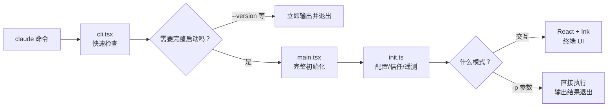
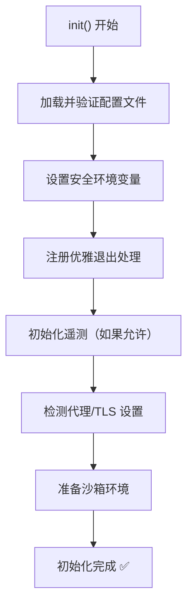

# 启动流程：CLI 的骨架

## 当你敲下 `claude` 的那一刻

你在终端里输入 `claude` 然后按回车。从这一刻到你看到交互界面，中间发生了什么？



## 两层入口，为什么？

Claude Code 有两个入口文件：`cli.tsx` 和 `main.tsx`。

**`cli.tsx`** 是第一个被执行的文件。它的职责很简单：

- 处理"秒退"命令，比如 `claude --version`
- 如果需要完整启动，**动态 import** 重量级模块

**`main.tsx`** 是真正的主程序。它：

- 用 Commander.js 注册所有 CLI 命令和选项
- 执行初始化（配置、安全检查、遥测）
- 根据参数决定进入交互模式还是单次执行模式

::: tip 为什么要分两层？
整个 Claude Code 打包后是一个 **13MB 的 JavaScript 文件**。如果每次 `claude --version` 都要加载全部代码，启动要好几秒。分两层让简单命令能秒退，复杂场景才加载完整模块。

这是 CLI 工具的常见优化手法——**懒加载**。
:::

## 初始化：在模型开始工作之前

`init.ts` 是初始化的核心。在模型收到你的第一条消息之前，系统需要做很多准备工作：



这些步骤里最值得注意的是：

- **配置层级**：设置从多个来源合并，后者覆盖前者：
  ```
  默认值 → 全局配置 → 项目配置 → 本地配置 → CLI 参数 → 环境变量
  ```
- **信任检查**：首次进入一个项目目录时，Claude Code 会问你是否信任这个目录
- **优雅退出**：注册 SIGINT/SIGTERM 处理，确保中断时不会留下损坏的文件

## 两种运行模式

初始化完成后，程序根据你的使用方式分成两条路：

### 交互模式（默认）

这是你平时用的模式。启动一个 React + Ink 的终端 UI，你可以持续对话：

```
你：帮我重构这个函数
Claude：好的，我先看看这个函数...（读文件）
        这个函数有这些问题...（分析）
        我来修改一下...（编辑文件）
        改完了，你看看？
你：再帮我加个测试
Claude：...
```

### 单次执行模式（`-p` 参数）

用于脚本和自动化。执行一次就退出：

```bash
claude -p "这个项目的 README 缺少安装说明，帮我补上" 
```

这个模式不启动终端 UI，直接输出结果到 stdout。适合集成到 CI/CD 管道或 shell 脚本中。

## Commander.js 模式

Claude Code 用 [Commander.js](https://github.com/tj/commander.js) 来管理 CLI 命令。如果你做过 Node.js CLI 工具，这个模式你一定不陌生：

```
claude                    → 交互模式（默认命令）
claude -p "..."           → 单次执行
claude mcp serve          → 启动 MCP 服务器
claude config set ...     → 修改配置
claude doctor             → 诊断问题
claude resume             → 恢复上次对话
```

每个子命令对应 `commands/` 目录下的一个文件，通过 `commands.ts` 统一注册。

## 小结

Claude Code 的启动流程其实就是一个标准的 CLI 工具模式：

1. **快速入口** → 处理简单命令
2. **完整初始化** → 配置、安全、环境
3. **模式分支** → 交互 or 单次执行

没有什么黑魔法。但接下来就要进入真正的核心了——[Agent 循环是怎么工作的？](/zh/4-agent-loop)
