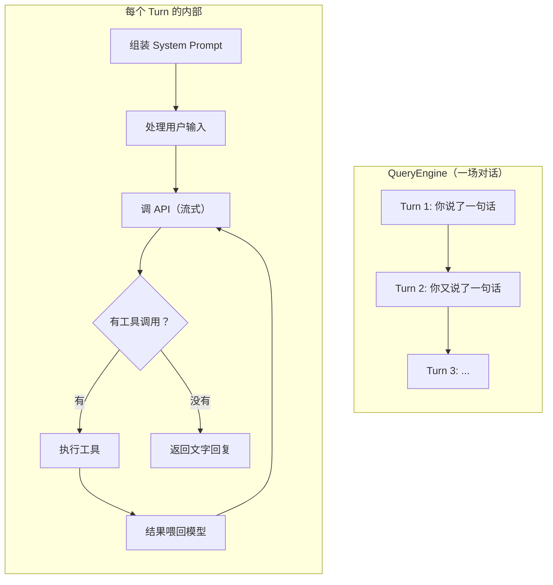
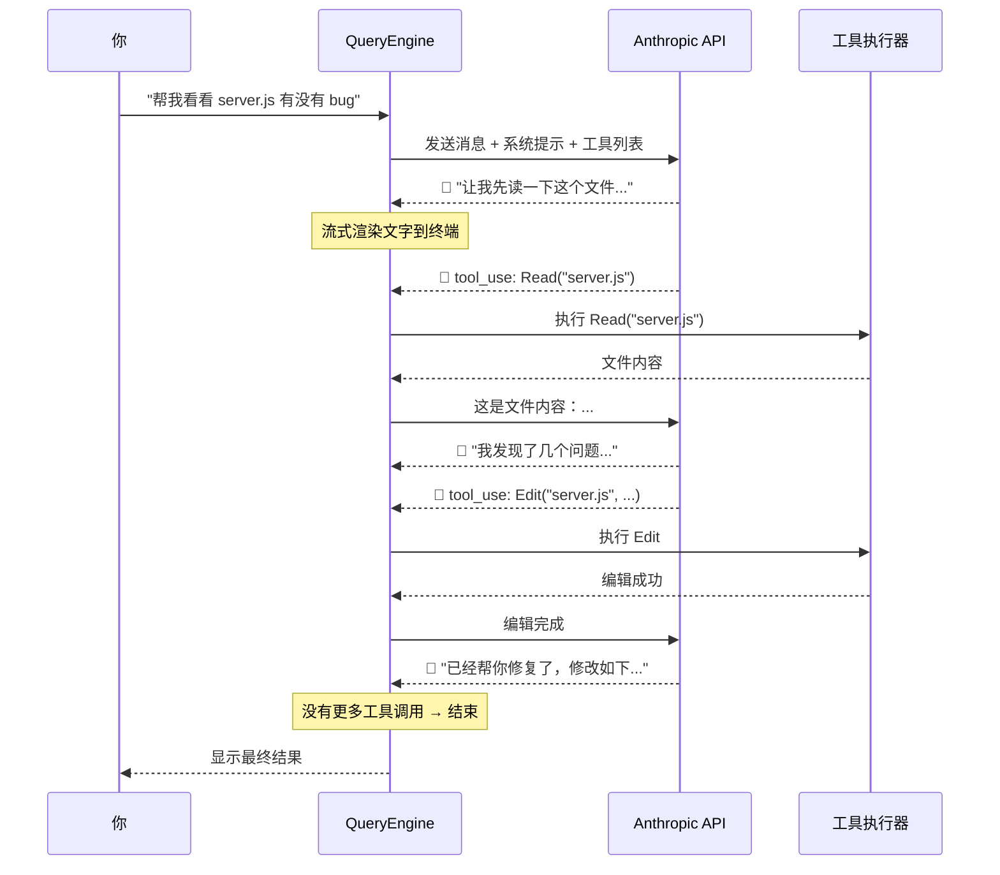

# Agent 循环：心脏

## QueryEngine —— 一切的中心

如果 Claude Code 是一个人，那 `QueryEngine` 就是它的心脏。这个类管理着一整场对话——记住你说过什么、模型回复了什么、调用了哪些工具、花了多少 token。

每次你在终端里输入一句话，就是 QueryEngine 的一个 **turn**（轮次）。



## System Prompt：告诉模型它是谁

在每次调用 API 之前，QueryEngine 会先组装一个 **System Prompt**——这是一段"背景说明"，告诉模型它身处什么环境、有什么能力、要遵守什么规则。

System Prompt 里包含这些信息：

| 内容 | 作用 |
|------|------|
| 可用工具列表 | 让模型知道它能用 Read、Bash、Edit 等工具 |
| 当前工作目录 | 让模型知道它在哪个项目里 |
| 项目上下文 | git 状态、项目结构等 |
| CLAUDE.md 内容 | 项目级的自定义指令（如果有的话） |
| 权限规则 | 哪些操作需要确认，哪些可以直接做 |
| MCP 服务器信息 | 有哪些外部工具可用 |

::: tip 你可能好奇的
CLAUDE.md 就像项目的"说明书"。你可以在里面写类似"这个项目用 Python 3.12，测试用 pytest，数据库用 PostgreSQL"这样的信息，Claude Code 每次都会读取它，这样它就"了解"你的项目了。
:::

## 流式响应：为什么感觉很快？

Claude Code 用的是 **Server-Sent Events (SSE)** 流式 API。模型的回复不是等全部生成完再返回，而是**一边生成一边往回推**。

这意味着：
- 你能看到模型"正在打字"的效果
- 工具调用在响应还没完全结束时就能检测到
- 整体感知速度比等全部生成完快很多



## Token 预算：不能无限循环

模型的上下文窗口有 **200K tokens** 的限制。QueryEngine 需要管理这个预算：

```
200K tokens
├── System Prompt    ～ 5-15K（取决于工具数量和项目信息）
├── 对话历史         ～ 大部分空间在这
├── 当前工具结果     ～ 可变
└── 预留生成空间     ～ 模型需要空间写回复
```

当对话太长、占用达到 75-92% 时，会触发**自动压缩**（compaction）。我们在[第 7 章](/zh/7-context)详细讲。

## 多轮执行的安全阀

除了 token 预算，还有其他停止条件：

- **maxTurns**：最大循环轮次（防止无限循环）
- **maxBudgetUsd**：花费上限（防止 API 费用失控）
- **用户中断**：你可以随时 Ctrl+C
- **模型主动停止**：模型判断任务完成了，返回纯文字

## AsyncGenerator：优雅的流式架构

QueryEngine 的 `submitMessage` 是一个 **AsyncGenerator**（异步生成器）。如果你不熟悉这个概念，可以这样理解：

::: info 什么是 AsyncGenerator？
普通函数：调一次，返回一个结果。
Generator：调一次，可以返回很多个结果，每次返回一个，调用方需要时再给下一个。
AsyncGenerator：和 Generator 一样，但每个结果的产生可以是异步的（比如等网络请求）。

Claude Code 用 AsyncGenerator 是因为：
- API 响应是流式的（异步一点点到达）
- UI 需要实时更新（每到一点就渲染一点）
- 工具执行是穿插在中间的（收到工具调用 → 暂停 → 执行 → 继续接收）

这样一来，UI 层只需要 `for await (const msg of engine.submitMessage(input))` 就能实时收到所有更新。
:::

## 完整的一次交互

把以上所有部分串起来，一次完整的交互是这样的：

1. 你在终端输入 "帮我修复 tests 里的失败用例"
2. QueryEngine 组装 System Prompt（工具列表 + 项目信息 + 规则）
3. 处理你的输入（解析 slash 命令、模型切换等）
4. 调用 Anthropic API，流式接收响应
5. 模型决定先读测试文件 → 执行 Read 工具 → 结果返回
6. 模型分析失败原因，决定修改代码 → 权限检查 → 执行 Edit 工具
7. 模型决定跑一下测试 → 执行 Bash 工具 (`npm test`)
8. 测试通过了，模型返回纯文字总结
9. QueryEngine 保存会话历史，这个 turn 结束

这一切都在那个 while 循环里完成。

接下来我们深入看看这些"工具"到底是什么——[工具系统：给 AI 双手](/zh/5-tool-system)。
