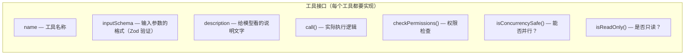
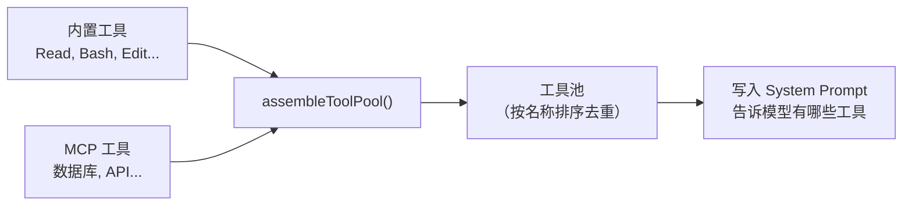
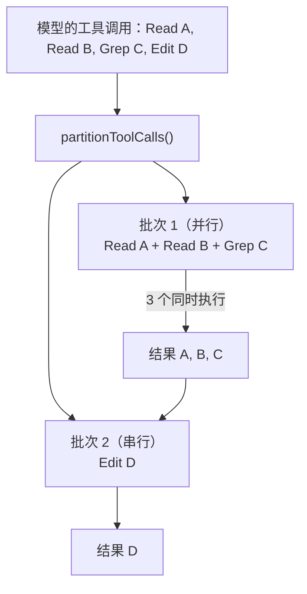

# 工具系统：给 AI 双手

## 没有工具的 AI = 只会说话

语言模型本身只能生成文字。它不能读你的文件、不能执行命令、不能上网搜索。**工具**就是连接模型和真实世界的桥梁。

Claude Code 通过定义一套标准的工具接口，让模型可以：

- 读你的代码 → **Read** 工具
- 搜索文件内容 → **Grep** 工具
- 修改代码 → **Edit** 工具
- 执行命令 → **Bash** 工具
- ... 以及更多

## 8 个核心工具

Claude Code 有大约 30 个内置工具，但最核心的是 8 个：

| 工具 | 做什么 | 类比 |
|------|--------|------|
| **Bash** | 执行任意 shell 命令 | 万能瑞士军刀 |
| **Read** | 读取文件内容 | 打开一个文件看 |
| **Write** | 创建或覆写文件 | 从头写一个文件 |
| **Edit** | 精确替换文件中的某段内容 | 在文件里找到一段话，改成另一段 |
| **Grep** | 用正则搜索文件内容 | 全局文本搜索 |
| **Glob** | 按文件名模式查找文件 | "找到所有 .ts 文件" |
| **Task** | 启动一个子 Agent | 派一个分身去做子任务 |
| **TodoWrite** | 结构化的任务追踪 | 待办清单 |

::: tip Bash 是万能后门
理论上，仅凭 Bash 一个工具就能做任何事——读文件（`cat`）、写文件（`echo >`）、搜索（`grep`）等等。但专用工具更安全、更可控、输出格式更友好。

Bash 是"最后手段"，当其他工具都无法满足需求时使用。正因如此，Bash 的权限检查也是最严格的。
:::

## 工具长什么样？

每个工具都遵循同一个接口——就像一个"合同"，规定了工具需要提供哪些能力：

这个统一接口的好处是：

- **新增工具很简单**：按接口填入内容就行
- **MCP 外部工具和内置工具平等对待**：模型不知道区别
- **权限检查是强制的**：每个工具必须声明自己的权限要求

## 工具是怎么被模型使用的？

整个过程分三步：

### 第 1 步：注册

启动时，所有内置工具被收集到一个数组。然后与 MCP 外部工具合并，按名称排序去重（内置工具优先）。

### 第 2 步：调用

模型在回复中说"我要用 Read 工具读 server.js"。这个请求先经过 Zod 验证输入参数，然后经过权限检查，最后执行。

### 第 3 步：返回

工具执行完成后，结果作为 `tool_result` 消息发回给模型。模型看到结果后决定下一步做什么。

## 只读 vs 写入：并发的秘密

这是 Claude Code 最精妙的设计之一。

模型可能在一次回复中请求多个工具调用，比如："读文件 A、读文件 B、搜索关键字 C、然后编辑文件 D"。

Claude Code 不会傻傻地逐个执行。它用 `partitionToolCalls` 函数把这些调用**智能分区**：

**规则很简单**：
- 连续的**只读工具**（Read, Grep, Glob）→ **并行执行**（最多 10 个同时）
- **写入工具**（Bash, Edit, Write）→ **串行执行**

::: info 为什么这么设计？
读文件不会改变文件，所以多个读操作可以安全地同时进行。但写操作可能互相冲突（比如两个工具同时修改同一个文件），所以必须一个一个来。

这个优化让 Claude Code 在需要"先看几个文件再做决定"的场景下快了好几倍。
:::

## 安全默认值

注意一个设计细节：`buildTool()` 函数有**安全的默认值**：

- 默认 **不可并行** (`isConcurrencySafe = false`)
- 默认 **不是只读** (`isReadOnly = false`)

这是 **fail-closed**（失败时关闭）设计——如果开发者忘了标记一个工具为可并行，它不会被意外地并行执行。安全第一。

## MCP：无限扩展

MCP（Model Context Protocol）让你可以给 Claude Code 添加自定义工具。比如：

- 一个查询数据库的工具
- 一个调用你公司内部 API 的工具
- 一个操作浏览器的工具（Playwright）

MCP 工具通过 `assembleToolPool` 和内置工具混在一起。对模型来说，它们没有区别——都是"我可以用的工具"。

## 小结

工具系统的核心设计原则：

1. **统一接口**：所有工具遵循同一个合同
2. **安全默认**：默认不并行、不只读，需要显式声明
3. **智能并发**：自动把只读操作并行化，写操作串行化
4. **平等对待**：MCP 外部工具和内置工具对模型来说一样

但给 AI 工具是危险的——它可能 `rm -rf /` 你的项目。怎么防止这种事？来看——[安全模型：五层护盾](/zh/6-security)。
