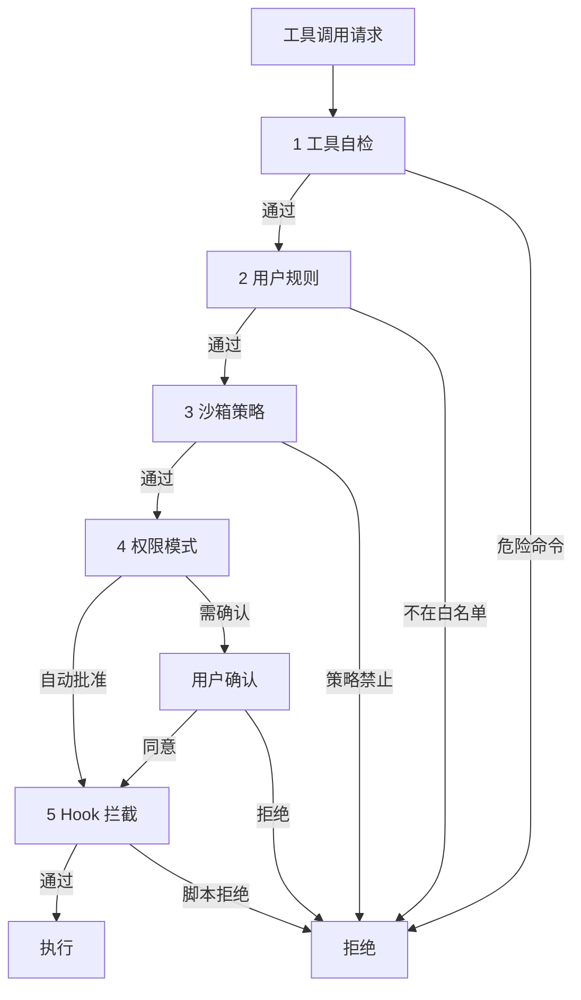

# 安全模型：五层护盾

## 为什么安全这么重要？

想象一下：你让一个 AI 帮你改代码。它可以执行 shell 命令、读写任意文件、甚至连网。如果没有安全措施，它可能会：

- 不小心删掉你的项目（`rm -rf .`）
- 把密钥推送到公开仓库
- 往生产环境的配置文件里写错误内容
- 执行恶意命令

Claude Code 需要既**强大**（能做很多事）又**安全**（不能失控）。它的解决方案是五层权限检查。

## 五层防线

每一个工具调用在执行前，都要通过五层检查。**任何一层说"不"，这个操作就不会执行。**



每一层的详细说明见下方。

### 第 1 层：工具自检

每个工具有自己的 `checkPermissions()` 方法。比如 Bash 工具会检测危险命令模式：

- `rm -rf /` → 拒绝
- `git push --force` → 警告
- `curl | bash` → 高风险标记

Read 工具会检查路径是否在项目范围内。Edit 工具会确认目标文件存在。

### 第 2 层：用户规则

你可以在 `settings.json` 里定义白名单和黑名单：

```json
{
  "allow": ["Read(**)", "Bash(npm:*)"],
  "deny": ["Bash(rm:*)", "Write(~/.ssh/*)"]
}
```

这意味着："允许读任何文件、允许 npm 相关命令；但禁止删除操作、禁止修改 SSH 密钥"。

### 第 3 层：沙箱策略

企业环境中，管理员可以设定全局策略，限制路径、命令和网络访问。个人用户通常不需要关心这层。

### 第 4 层：权限模式

Claude Code 有 5 种权限模式，决定了"什么操作需要问你"：

| 模式 | 文件编辑 | Shell 命令 | 适用场景 |
|------|---------|-----------|---------|
| **default** | 每次都问 | 每次都问 | 刚开始用，最安全 |
| **acceptEdits** | 自动批准 | 每次都问 | 日常开发的好选择 |
| **plan** | 不允许 | 不允许 | 只看不改，研究代码时 |
| **bypass** | 自动批准 | 自动批准 | 完全信任模型时 |
| **auto** | 自动批准 | 自动批准 | CI/CD 自动化场景 |

### 第 5 层：Hook 拦截

这是最灵活的一层。你可以写自定义脚本，在任何工具执行前/后触发：

**PreToolUse Hook** — 工具执行**前**，你的脚本可以：
- 拦截并拒绝这次调用
- 修改工具的输入参数
- 无条件放行

**PostToolUse Hook** — 工具执行**后**，你的脚本可以：
- 检查结果是否合理
- 在每次文件编辑后自动跑 linter
- 记录操作日志

::: tip 实际用例
你可以写一个 Hook：每次 Bash 工具被调用时，检查命令里有没有包含敏感关键字（如密码、token）。如果有，自动拒绝。

这比手动审核每一个命令高效多了。
:::

## 为什么是五层？

你可能会问：一层不就够了吗？干嘛搞这么复杂？

每一层解决不同的问题：

| 层 | 解决的问题 |
|----|-----------|
| 工具自检 | 防止明显的危险操作（技术层面） |
| 用户规则 | 个人偏好，"我的项目里什么能做什么不能做" |
| 沙箱策略 | 组织层面的合规要求 |
| 权限模式 | 根据场景调节自动化程度 |
| Hook | 自定义的、可编程的兜底逻辑 |

**大多数操作在前两层就快速通过了。** 用户实际感受到的提示很少，只有真正"不寻常"的操作才会弹出确认。这就是好的安全设计——既不烦人，又确实安全。

## 小结

Claude Code 安全模型的关键洞察：

1. **分层而非单点** — 任何一层被绕过，还有其他层兜底
2. **默认拒绝** — 没有明确允许的操作都要确认
3. **可编程** — Hooks 让你可以自定义任何安全逻辑
4. **不同场景不同策略** — 5 种模式满足从最安全到最自由的需求

安全的问题解决了，但还有一个大问题——模型的"记忆"是有限的。长对话怎么办？来看——[智能记忆：上下文管理](/zh/7-context)。
