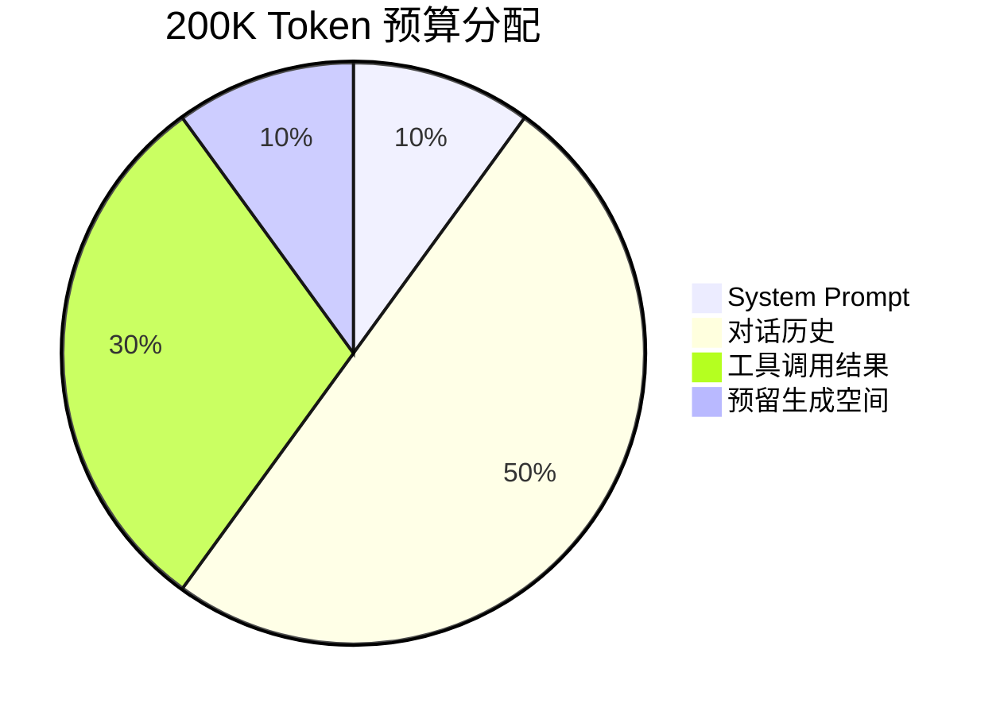
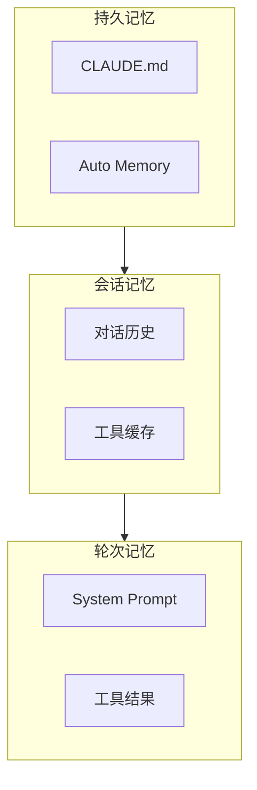

# 智能记忆：上下文管理

## 200K 的预算怎么花？

Claude 模型的上下文窗口是 **200K tokens**（大约 15 万个英文单词或 10 万个中文字）。听起来很多，但在 Agent 场景下，消耗速度比你想象的快得多：

> System Prompt 包含工具描述和项目信息，通常占 5-15K tokens。

一次 `Read` 调用可能返回几千 tokens 的文件内容；一次 `Bash` 可能返回大量日志输出；对话进行了十几轮后，历史消息本身就占了大半。

**上下文不够用了怎么办？** 这就是 Claude Code 的压缩策略要解决的问题。

## 自动压缩：总结而非丢弃

当上下文占用达到 **75-92%** 时，Claude Code 自动触发 **compaction**（压缩）：

**压缩不是丢弃。** 它把早期的对话轮次总结成简短的摘要，保留关键信息（比如"用户让我修复了 X 文件的 bug，已经修改并测试通过"），丢弃冗余细节（比如完整的文件内容和命令输出）。

::: info 可以自定义压缩行为
Claude Code 在压缩前后各有 hook 点。你可以指定"这条信息绝对不能被压缩"或"压缩后额外注入这些上下文"。

这在处理重要的项目约束时很有用——比如"永远不要修改 production.config.js"这样的指令。
:::

## "Search, Don't Index" —— 搜索而非索引

这是 Claude Code 最有争议也最有教育意义的设计决定。

### 你可能以为会有的方案

很多 AI 编程工具用 **RAG（检索增强生成）**：

1. 启动时用 embedding 模型把整个代码库转成向量
2. 用户提问时，先搜索最相关的代码片段
3. 把相关片段注入到模型的上下文中
4. 模型基于这些片段回答

### Claude Code 实际用的方案

Claude Code 不用 RAG。它直接让模型调用 **Grep**（ripgrep）和 **Glob** 工具来搜索。

```mermaid
flowchart LR
    subgraph RAG ["RAG 方案"]
        direction TB
        R1["向量化"] --> R2["相似度搜索"]
        R2 --> R3["注入上下文"]
    end

    subgraph GREP ["Search 方案"]
        direction TB
        G1["模型决定搜什么"] --> G2["ripgrep 搜索"]
        G2 --> G3["返回结果"]
    end
```

> 左：RAG 方案（Claude Code **不用**） | 右：Search 方案（Claude Code **用的**）

### 为什么 grep 比 RAG 好？（在这个场景下）

| 维度 | RAG | grep 搜索 |
|------|-----|----------|
| **需要索引** | 要。启动慢，需要同步更新 | 不要。即搜即用 |
| **外部依赖** | 需要 embedding 服务 | 只需要 ripgrep（本地） |
| **安全性** | 代码可能发送到外部 embedding API | 完全本地，不泄露代码 |
| **准确性** | 语义近似，可能不精确 | 精确匹配，不会遗漏 |
| **复杂度** | 需要维护索引、处理增量更新 | 零维护 |
| **Token 成本** | 低（只注入相关片段） | 高（模型可能搜多次） |

::: tip 核心取舍
RAG 省 token 但复杂；grep 费 token 但简单。

当模型足够聪明（知道该搜什么关键字）且上下文窗口足够大（200K）时，grep 的"笨办法"反而更实用。

Anthropic 团队说：他们**试过 RAG**，内部基准测试显示 grep 方案效果更好。
:::

## 记忆层级

Claude Code 的"记忆"不止是对话历史。它有一个完整的记忆层级：

| 层级 | 生命周期 | 谁写的 | 内容 |
|------|---------|-------|------|
| **CLAUDE.md** | 永久 | **你写** | 项目规则、构建命令、架构说明 |
| **Auto Memory** | 跨会话 | **Claude 写** | Claude 自己总结的经验和模式 |
| **对话历史** | 当前会话 | 对话产生 | 你和 Claude 的对话记录 |
| **工具缓存** | 当前会话 | 工具产生 | 已读文件内容，避免重读 |
| **System Prompt** | 每次 API 调用 | 系统组装 | 工具列表、项目信息、规则 |

### CLAUDE.md — 你写给 Claude 的说明书

CLAUDE.md 是一个你手动维护的 Markdown 文件。你可以在里面写项目信息，它会在每次会话启动时**自动加载**到 System Prompt 中。

CLAUDE.md 可以存在多个层级：

| 位置 | 作用域 | 是否提交到 git |
|------|--------|--------------|
| `~/.claude/CLAUDE.md` | 全局（所有项目） | 否 |
| `项目根目录/CLAUDE.md` | 当前项目（团队共享） | 是 |
| `项目根目录/.claude/CLAUDE.md` | 当前项目 | 可选 |

::: tip 建议控制在 200 行以内
CLAUDE.md 的内容会占用 System Prompt 的 token 预算。写太多反而浪费上下文空间。重点写：构建命令、测试命令、项目架构、编码规范。
:::

### Auto Memory — Claude 自己记的笔记

这是很多人好奇的功能。**Auto Memory 是 Claude 自动写的**，不需要你手动操作。

它存储在 `~/.claude/projects/<项目名>/memory/` 目录下：
- **MEMORY.md** — 主索引文件，每次会话自动加载前 200 行
- **Topic 文件** — 按主题分类的笔记（调试经验、构建命令等）

Claude 在工作过程中会**自动发现和记录**有用的模式，比如"这个项目用 pnpm 而不是 npm"、"测试要用 pytest -v 才能看到详细输出"。

::: warning 你可能没注意到它在工作
Auto Memory 是静默运行的——Claude 不会明确告诉你"我正在记笔记"。你可以用 `/memory` 命令查看它记了什么，也可以开关这个功能。

如果你在用 Claude Code 时感觉"它好像越来越了解我的项目了"，那就是 Auto Memory 在起作用。
:::

### 和其他工具的对比

| 工具 | 手动记忆 | 自动记忆 |
|------|---------|---------|
| **Claude Code** | CLAUDE.md（你写） | Auto Memory（Claude 写） |
| **Codex** | 配置文件 | 有，每次会话后自动记录 |
| **Cursor** | Rules / .cursorrules | 有 Memories 功能（设置中开启） |

## 实际效果

这套上下文管理系统的实际效果是：

1. **短对话**（几轮）：完全不需要压缩，200K 绰绰有余
2. **中等对话**（十几轮）：可能触发一次压缩，不影响使用
3. **长对话**（几十轮）：多次压缩，但关键信息保留。极长对话可能会"忘记"早期细节
4. **跨会话**：通过 CLAUDE.md 和 Auto Memory，项目级知识永不丢失

## 小结

上下文管理的核心原则：

1. **压缩而非丢弃** — 旧消息被总结，不是被删
2. **简单胜过精巧** — grep 搜索比 RAG 更可靠
3. **分层记忆** — 不同生命周期的信息用不同方式存储
4. **安全优先** — 不把代码发给外部服务做索引

到这里，你已经理解了 Claude Code 的所有核心系统。最后一章——[自己动手：从读者到构建者](/zh/8-build-your-own)。
