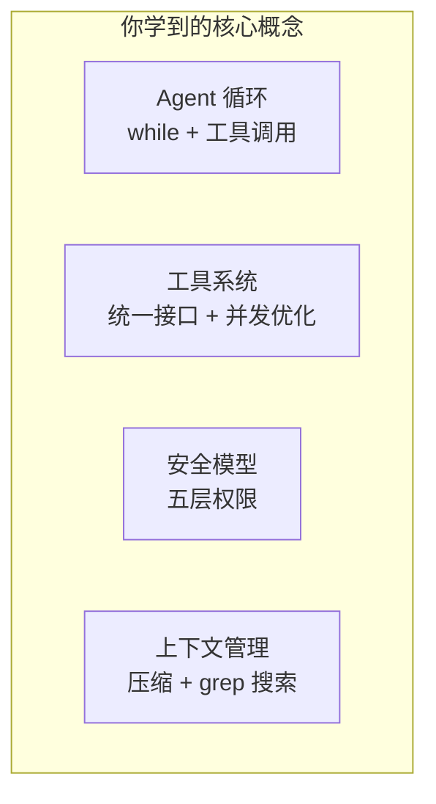
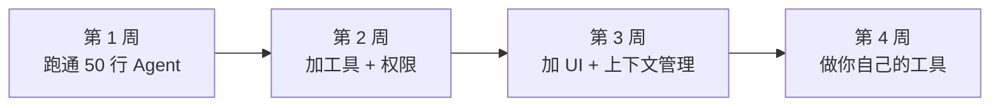

# 自己动手：从读者到构建者

## 你已经知道的

通过前面 7 章，你已经理解了 Claude Code 的全貌：



这些不是 Claude Code 特有的概念——它们是**所有 AI Agent 系统的基础构件**。

## 50 行代码：最简 Agent

下面是一个能运行的最简 AI Agent。它实现了 Claude Code 的核心循环——调用模型、执行工具、循环直到完成：

```python
import anthropic, subprocess, json

client = anthropic.Anthropic()

tools = [
    {
        "name": "bash",
        "description": "Run a bash command and return stdout",
        "input_schema": {
            "type": "object",
            "properties": {"command": {"type": "string"}},
            "required": ["command"]
        }
    },
    {
        "name": "read_file",
        "description": "Read a file and return its contents",
        "input_schema": {
            "type": "object",
            "properties": {"path": {"type": "string"}},
            "required": ["path"]
        }
    }
]

def run_tool(name, args):
    if name == "bash":
        r = subprocess.run(args["command"], shell=True,
                          capture_output=True, text=True, timeout=30)
        return r.stdout + r.stderr
    if name == "read_file":
        return open(args["path"]).read()
    return "Unknown tool"

def agent(task):
    messages = [{"role": "user", "content": task}]

    while True:
        resp = client.messages.create(
            model="claude-sonnet-4-20250514",
            max_tokens=4096,
            tools=tools,
            messages=messages,
        )
        # Collect assistant response
        messages.append({"role": "assistant", "content": resp.content})

        # No more tool calls -> done
        if resp.stop_reason == "end_turn":
            return [b.text for b in resp.content if hasattr(b, "text")]

        # Execute tool calls and feed results back
        results = []
        for block in resp.content:
            if block.type == "tool_use":
                output = run_tool(block.name, block.input)
                results.append({
                    "type": "tool_result",
                    "tool_use_id": block.id,
                    "content": output
                })
        messages.append({"role": "user", "content": results})

# Try it
for line in agent("List the files in the current directory"):
    print(line)
```

::: tip 这就是 Claude Code 的核心
认真看上面的 `while True` 循环——这就是 Claude Code 几万行代码的骨架。区别只是 Claude Code 有更多工具、权限检查、UI、上下文管理等"装饰"。

你可以用不到一杯咖啡的时间写出 Agent 的核心。
:::

## 用什么模型？

你不一定要用 Claude。任何支持 **tool use / function calling** 的模型都可以：

| 方案 | 模型 | 费用 | 效果 |
|------|------|------|------|
| **Anthropic API** | Claude Sonnet / Opus | 按 token 付费 | 最佳 |
| **OpenAI API** | GPT-4o / o3 | 按 token 付费 | 很好 |
| **本地部署** | Qwen, DeepSeek, Llama | 免费（需要显卡） | 可用，工具调用能力稍弱 |
| **中转/聚合** | 各种平台 | 低价 | 取决于底层模型 |

**不需要本地跑模型。** 大多数人调用 API 就行。本地模型目前在 tool use 准确性上还有差距。

## 和现有工具有什么区别？

你可能会问：那我为什么不直接用 Claude Code / Cursor / Cline？

| | Claude Code | Cursor | Cline | 自己做 |
|---|---|---|---|---|
| **谁开车** | AI 开车，你监督 | 你开车，AI 辅助 | 灵活 | 你定义 |
| **模型** | 只能 Claude | 多模型 | 任意模型 | 任意模型 |
| **界面** | 终端 | IDE | IDE 插件 | 你设计 |
| **定制性** | 中等 | 有限 | 中等 | 完全自由 |
| **数据隐私** | 云端 | 云端 | 你控制 | 你控制 |
| **费用** | $20/月起 | $20/月起 | 只付 API 费 | 只付 API 费 |

### Sub-Agent 与 Coordinator 模式

Claude Code 不只是一个 Agent，它是一群。

**Task 子 Agent** 生成一个新的对话，有自己独立的上下文窗口。但子 Agent 有严格的"自我意识"注入——代码会告诉它："你是一个工人，不是经理。别想着再雇人，自己干活。"（`depth=1`，防止递归生成）

**Coordinator 模式** 更进一步：Claude Code 变成一个纯粹的任务编排者，自己不干活，只分配。核心原则是 "Parallelism is your superpower"——只读研究任务并行跑，写文件任务按文件分组串行跑。

为了最大化子 Agent 的缓存命中率，所有子代理的工具结果都使用**相同的占位符文本**。因为 Claude API 的 prompt cache 是基于字节级前缀匹配的——如果 10 个子 Agent 的前缀字节完全一致，那么只有第一个需要"冷启动"，后面 9 个直接命中缓存。

**自己做的价值不是"做一个更好的 Cursor"**，而是：

1. **学习** — 理解 Agent 原理是当下最热的技术方向
2. **定制** — 做专注于特定领域的工具（数据分析、DevOps、文档等）
3. **控制** — 完全掌握数据流向和成本
4. **产品** — 把它做成服务特定人群的产品

## 三个级别的项目想法

### 入门级：个人 CLI 助手

基于上面的 50 行代码扩展：
- 加入文件编辑工具（Write, Edit）
- 加入基本的权限确认（bash 命令前问一句）
- 加入对话历史保存和恢复
- 用 [Rich](https://github.com/Textualize/rich)（Python）或 [Ink](https://github.com/vadimdemedes/ink)（Node.js）做漂亮的终端 UI

### 中级：领域专用 Agent

选一个你熟悉的领域，做一个专用工具：
- **数据分析 Agent**：工具包括读 CSV、执行 SQL、画图表
- **DevOps Agent**：工具包括检查服务状态、读日志、重启服务
- **文档 Agent**：工具包括读 Markdown、生成目录、检查链接
- **代码审查 Agent**：工具包括读 PR diff、检查规范、生成审查意见

关键是**工具集的设计**——你给 Agent 什么工具，它就有什么能力。

### 高级：Agent 平台

更大的想法：
- **MCP 工具市场** — 做一个 MCP 服务器的发现和分发平台
- **Agent 调试器** — 可视化 Agent 的执行过程，帮助调试
- **多 Agent 协作框架** — 参考 Claude Code 的 Task 工具和 Teams 系统

## 推荐学习路线



| 阶段 | 目标 | 资源 |
|------|------|------|
| 第 1 周 | 跑通最简 Agent | 本章的 50 行代码 |
| 第 2 周 | 添加 3-5 个工具 + 基本权限 | 源码 `tools/` 目录参考 |
| 第 3 周 | 加入流式输出 + 上下文压缩 | 源码 `services/compacting/` 参考 |
| 第 4 周 | 做一个特定领域的 Agent MVP | 你自己的想法 |

## 延伸资源

### 官方资料
- [Anthropic Engineering Blog: Best Practices](https://www.anthropic.com/engineering/claude-code-best-practices)
- [Claude Code 官方文档](https://code.claude.com/docs)

### 社区分析
- [Inside Claude Code's Architecture](https://dev.to/oldeucryptoboi/inside-claude-codes-architecture-the-agentic-loop-that-codes-for-you-cmk) — 英文深度架构分析
- [Architecture & Internals Guide](https://cc.bruniaux.com/guide/architecture/) — 最全面的架构文档
- [Claude Code 逆向工程](https://yuyz0112.github.io/claude-code-reverse/README.zh_CN.html) — 中文运行时分析
- [Claude Code 源码解析](https://claudecoding.dev/) — 中文系列教程

### 动手教程
- [Build Your Own in Python (250 Lines)](https://www.heyuan110.com/posts/ai/2026-02-24-build-magic-code/)
- [Claude Agent SDK TUI](https://www.mager.co/blog/2026-03-14-claude-agent-sdk-tui/)
- [OpenCode](https://opencode.ubitools.com/) — 开源终端 AI Agent

---

## 最后的洞察：Claude Code 是一个操作系统

读完全部源码后，你会发现一个惊人的类比——Anthropic 不是在做一个聊天机器人，他们在做一个**以 LLM 为内核的操作系统**：

| 操作系统概念 | Claude Code 对应 |
|------------|-----------------|
| 系统调用 | 42 个工具 |
| 用户权限管理 | 五层权限系统 |
| 应用商店 | 技能系统（Skills） |
| 设备驱动 | MCP 协议 |
| 进程管理 | Agent 蜂群 + Coordinator |
| 内存管理 | 三层上下文压缩 |
| 文件系统 | Transcript 持久化 |

这解释了为什么 51 万行代码里只有 5% 在调用 LLM API——剩下 95% 都是"操作系统"的基础设施。

::: info 最后一句话
51 万行代码。1903 个文件。18 个安全文件只为一个 Bash 工具。9 层审查只为让 AI 安全地帮你敲一行命令。

Claude Code 的架构告诉我们：**要让 AI 真正有用，你不能把它关在笼子里，也不能放它裸奔。你得给它建一套完整的信任体系。** 而最好的"框架"就是没有框架——一个 while 循环 + 好的工具 + 好的提示词，加上 95% 的工程化脚手架。

现在，轮到你了。
:::
