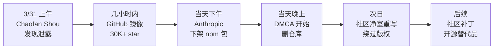

# 吃瓜专区：Claude Code 源码泄露全记录

::: danger 事件速览
2026 年 3 月 31 日，Anthropic 发布到 npm 的 Claude Code v2.1.88 包中，意外包含了 60MB 的 source map 文件。**51.2 万行 TypeScript 源码、1906 个文件、44 个 feature flag、120+ 个秘密环境变量**——就这样暴露在公网上。

Anthropic 官方回应："a release packaging issue caused by human error"。但互联网没有删除键。
:::

## 时间线



### 怎么泄露的？

安全研究员 **Chaofan Shou ([@Fried_rice](https://x.com/Fried_rice/status/2038894956459290963))** 发现 `@anthropic-ai/claude-code` npm 包里有一个 `cli.js.map` 文件（source map，本该在构建时剥离）。这个文件指向了一个公开的 Cloudflare R2 存储桶，里面是一个 59.8MB 的 zip 压缩包，包含完整的未混淆 TypeScript 源码。

根本原因：Claude Code 使用 [Bun](https://bun.sh/) 作为构建工具。Bun 有一个 [已知 bug](https://github.com/oven-sh/bun/issues/28001)（2026-03-11 提交）——即使在生产模式下也会输出 source map。而 Anthropic 去年刚[收购了 Bun](https://www.anthropic.com/news/anthropic-acquires-bun-as-claude-code-reaches-usd1b-milestone)。

> 用自家工具的 bug 泄露了自家产品的源码——这大概是 2026 年最讽刺的技术事件了。

更讽刺的是：**这是 Anthropic 一周内第二次意外泄露**，几天前他们刚泄露了模型规格文档（model spec）。

---

## 八大隐藏功能

社区扒出了大量未发布的功能和 feature flag。以下是最劲爆的发现：

### 1. 卧底模式（Undercover Mode）

::: warning 最具争议的发现
这个功能让 AI **伪装成人类**。
:::

文件 `src/utils/undercover.ts`（约 90 行）实现了一个模式：当 Anthropic 员工在非内部仓库（开源项目）贡献代码时，自动激活。

它会：
- 从 commit 和 PR 中删除所有 Anthropic 痕迹
- 移除 `Co-Authored-By` 头部
- 删除 "Claude Code" 或模型名称的任何提及
- 将 commit 消息伪装为人类开发者编写
- 禁止提及内部代号（如 "Capybara"、"Tengu"）

源码中有一行关键注释：

> **"There is NO force-OFF. This guards against model codename leaks."**

你可以用 `CLAUDE_CODE_UNDERCOVER=1` 强制开启，但**无法强制关闭**。这是一个单向门。

### 2. 虚拟宠物系统（Buddy）

这是准备在 4 月 1 日愚人节发布的彩蛋——一个完整的**电子宠物**系统：

| 属性 | 详情 |
|------|------|
| **物种** | 18 种：鸭子、幽灵、龙、章鱼、猫头鹰、企鹅、海龟、水豚、仙人掌、蘑菇等 |
| **稀有度** | 普通 60%、稀有 25%、史诗 10%、传说 4%、**闪光 1%** |
| **属性值** | DEBUGGING、PATIENCE、CHAOS、WISDOM、SNARK |
| **装饰** | 帽子（皇冠、礼帽、螺旋桨帽、光环、巫师帽等）+ 眼睛样式 |
| **可能组合** | 约 4298 万种传说级组合 |

宠物通过你的 userId 使用 Mulberry32 PRNG 确定性生成——**同一个账号永远是同一只宠物**。

物种名称用 `String.fromCharCode()` 编码，专门用来躲避构建系统的 grep 检查。

### 3. 反蒸馏机制（Anti-Distillation）

Claude Code 有两套防止竞争对手"抄作业"的机制：

**假工具注入（Fake Tool Injection）**：当 `ANTI_DISTILLATION_CC` 标志开启时，API 请求会带上 `anti_distillation: ['fake_tools']`，告诉服务端向系统提示词中注入**假工具定义**。如果有人在录制 API 流量来训练模型，假工具会污染训练数据。

**连接文本摘要（Connector-text Summarization）**：服务端将工具调用之间的推理文本缓冲、摘要、并附上密码学签名。录制者只能拿到摘要，而非完整的思维链。

不过真正想绕过的人大约一小时就能搞定——真正的保护还是靠法律。

### 4. 用正则检测用户愤怒

一个 LLM 公司用**正则表达式**做情绪分析——这本身就很讽刺。

`src/utils/userPromptKeywords.ts` 里有一段正则：

```
/\b(wtf|wth|ffs|omfg|shit(ty|tiest)?|dumbass|horrible|awful|
piss(ed|ing)? off|piece of (shit|crap|junk)|what the (fuck|hell)|
fucking? (broken|useless|terrible|awful|horrible)|fuck you|
screw (this|you)|so frustrating|this sucks|damn it)\b/
```

为什么不用 LLM 来判断？因为一个正则比一次 LLM 推理**快几千倍也便宜几千倍**，只是用来检查用户是不是在骂人而已。

### 5. KAIROS：未发布的自主 Agent 模式

KAIROS 是源码中出现频率最高的 feature flag 之一。它看起来是一个**永不停止运行的后台 Agent**：

- `/dream` 技能：夜间记忆蒸馏
- 每日追加式日志
- GitHub webhook 订阅
- 后台 daemon worker
- 每 5 分钟 cron 刷新

这可能是 Claude Code 路线图中最大的产品泄露。

### 6. 原生客户端认证（DRM for API）

`src/constants/system.ts` 中，API 请求包含一个 `cch=00000` 占位符。在请求离开进程之前，Bun 的原生 HTTP 栈（用 Zig 写的）会把这 5 个零替换成一个计算出的哈希值。服务端验证哈希来确认请求来自真正的 Claude Code 二进制文件。

占位符长度固定是为了不改变 Content-Length 或触发缓冲区重新分配。计算发生在 JavaScript 运行时之下，JS 层完全不可见。**这基本上是 API 调用的 DRM。**

### 7. 每天浪费 25 万次 API 调用的 Bug

`autoCompact.ts` 中的注释暴露了一个惊人数据：

> "BQ 2026-03-10: 1,279 sessions had 50+ consecutive failures (up to 3,272) in a single session, wasting ~250K API calls/day globally."

自动压缩失败后会疯狂重试。修复方案？**3 行代码**：连续失败 3 次后禁用压缩。

### 8. 23 道 Bash 安全检查

每个 bash 命令执行前要通过 `bashSecurity.ts` 中的 **23 项安全检查**：
- 18 个被屏蔽的 Zsh 内建命令
- 防御 Zsh equals 展开（`=curl` 绕过权限检查）
- Unicode 零宽空格注入检测
- IFS null-byte 注入防御
- HackerOne 审计中发现的畸形 token 绕过

---

## 社区花活大赏

### 最快花活：镜像与分析

泄露后几小时内，GitHub 上出现了大量备份仓库，累计 **30,000+ star、40,000+ fork**。Hacker News、知乎、36 氪全是拆解贴。有人直接让 Claude 读自己的源码然后吐槽。

### 最实用花活：开源替代品

- **[OpenCode](https://opencode.ai/)**：基于泄露的架构理解打造的开源替代品，支持 75+ LLM 提供商（GPT、DeepSeek、Gemini、Ollama），GitHub 120K+ star
- **[leaked-claude-code](https://github.com/leaked-claude-code/leaked-claude-code)**：完整重建版，补全了依赖和构建配置，可以实际编译运行
- **[tweakcc](https://github.com/Piebald-AI/tweakcc)**：CLI 魔改工具，支持自定义系统提示词、主题、token 计数

### 最省钱花活：社区补丁

源码暴露了两个超级吃 token 的坑：

| Bug | 影响 | 社区修复 |
|-----|------|---------|
| `autoCompact` 无限重试 | 全球每天浪费 25 万次 API 调用 | 熔断器：3 次失败后停止 |
| 断开续聊缓存失效 | 每次重新计算完整上下文 | [cc-cache-fix](https://github.com/AbdoKnbGit/claude-code-memory) 补丁 |
| 工具定义 token 浪费 | 55,000 tokens 的工具描述 | 压缩到 ~2,400 tokens |

社区还做了 **cache keepalive** 补丁（每 55 分钟 ping 一次防止 5 分钟缓存过期），Max/Pro 用户打上后续聊明显省 token。

### DMCA 大战

Anthropic 迅速发出 DMCA 通知，直接复制源码的仓库被 GitHub 下架。但韩国开发者 instructkr **连夜用新语言净室重写**，直接绕过版权——仓库继续活得好好的。

十天前 Anthropic 还[向 OpenCode 发了律师函](https://github.com/anomalyco/opencode/pull/18186)，要求移除内置的 Claude 认证功能（因为第三方工具用 Claude Code 的内部 API 以订阅价而非按 token 计费）。

### 名场面语录

> "accidentally shipping your source map to npm is the kind of mistake that sounds impossible until you remember that a significant portion of the codebase was probably written by the AI you are shipping."
> — Twitter 网友

> "AI 自己把自己泄露了然后研究人类反应"
> — 知乎网友

> "Anthropic 被动开源"
> — 社区 meme

---

## Prompt Cache 的极致工程

泄露的源码展示了 Anthropic 在 prompt 缓存上的疯狂优化：

`promptCacheBreakDetection.ts` 追踪 **14 种缓存中断向量**，有"粘性锁存器"防止模式切换导致缓存失效。有一个函数被标注为 `DANGEROUS_uncachedSystemPromptSection()`——当你为每个 token 付费时，缓存失效不再是计算机科学笑话，而是一个会计问题。

终端渲染引擎也借鉴了游戏引擎技术：`Int32Array` 支持的 ASCII 字符池、位掩码编码的样式元数据、合并光标移动的补丁优化器、自淘汰的行宽缓存（源码声称 "~50x reduction in stringWidth calls during token streaming"）。

---

## 对开发者的价值

这次泄露对普通用户没有安全风险（不涉及模型权重和用户数据），但对开发者来说是**纯金工程宝典**：

| 学到了什么 | 具体内容 |
|-----------|---------|
| **权限模型设计** | 五层检查 + 23 道 Bash 安全检查 |
| **Prompt 工程** | 缓存边界优化、14 种中断检测、per-tool prompt.ts |
| **Agent 架构** | while 循环 + 工具执行 + 多 Agent 协调 |
| **上下文管理** | 三层压缩 + AI 记忆检索 + KAIROS |
| **工程纪律** | Hooks + Lint 自动执行 CLAUDE.md 规则 |
| **性能优化** | 游戏引擎级终端渲染 + 启动懒加载 |
| **防御工程** | 反蒸馏、原生认证、DRM for API |

::: tip 这就是为什么我们做了这个教程网站
51 万行源码太多了，大多数人没时间看。我们把精华拆解成 8 章通俗教程，让你用几个小时理解别人几周才能看懂的内核。

[从第一章开始学习 →](/zh/1-what-is-this)
:::

---

## 参考链接

- [Chaofan Shou 的原始发现推文](https://x.com/Fried_rice/status/2038894956459290963)
- [Alex Kim 的深度分析](https://alex000kim.com/posts/2026-03-31-claude-code-source-leak/) — 最详细的技术分析
- [Dev.to 512K 行分析](https://dev.to/vibehackers/i-analyzed-all-512000-lines-of-claude-codes-leaked-source-heres-what-anthropic-was-hiding-4gg8)
- [Aiia 的泄露内容分析](https://aiia.ro/blog/claude-code-source-code-leaked-npm)
- [Buddy 宠物系统逆向](https://variety.is/posts/claude-code-buddies/)
- [HitCC 百万字逆向文档](http://www.v2ex.com/t/1202048)
- [Hacker News 讨论](https://news.ycombinator.com/item?id=47584540)
